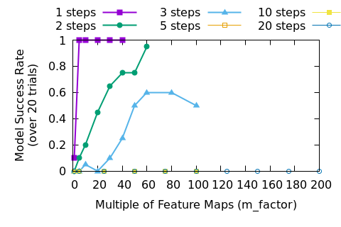

Large DNNs Look Good, But They May Be Fooling Us
------------------------------------------------

Deep neural networks (DNNs), like a fine cake of Pu'er tea, have gotten better with age. Our
hardware grows in capacity, we make our DNNs bigger, and our machine learning hammer smashes ever
more difficult problems. Can we expect that to go on forever? How long until the singularity? Is it
even worth it to brush your teeth when powerful language models are going to do everything for us by
some time next week?

It is unfortunate, but people are getting swept away by the hype without considering how to build
the future.
It is true that research labs and industrial groups are pressing forward with a seemingly
endless campaign of shock an awe--and the breakthroughs in robotics, large language models, and image
generation have generated justifiable excitement. However, if we dig
into the underlying technology, we will be forced to admit that stochastic gradient descent (SGD),
the "learning" algorithm that is behind all of our current network training, is flawed in a way that
demands vastly more resources than should be required to solve a task. The growth in memory and
compute that we must sacrifice to SGD is untenable, and it is only a matter of time until we run
into a wall.

As researchers working in this field it is up to us to anticipate this problem and find a solution
before it slows the industry down. Let's get technical.

In a paper from 2020, [It's Hard for Neural Networks to Learn the Game of
Life](https://arxiv.org/abs/2009.01398), some researchers pointed out that a small network struggles
to learn a seemingly simple problem. They make the network larger and the success rate of training
goes up, not to 100% but who expects perfection? AI wins, we all go home happy. Let's dig into what
happened here though, since the problem is simple enough for us to fully pick apart but has enough
depth to demonstrate a problem.

There are many lessons we can learn from this, but the most important thing that we can realize is
that it is possible to apply deep learning to a problem in a such a way that we get seemingly good
results while, in actuality, the neural network is converging to a bad (meaning inefficient and
unreliable) solution.

## Conway's Game of Life

The Game of Life, created by John Horton Conway, is played on a grid of tiles. Each tile is either
"alive" or "dead" (or black and white for visual purposes, 1 and 0 for digital purposes). It is a
rough simulation of life; if a cell is surrounded by too many other cells (4) then it "starves" and
is no longer living in the next time step. If a living cell does not have enough living neighbors
(less than 2) then it also dies (from loneliness I suppose) and empty cells can be brought to life
if they have three living neighbors. Diagonals don't count as neighbors, only the four adjacent
cells.

The dead or alive determination is made for every cell on the board, which can be of arbitrary size,
and each one is updated to move on to the next time step. Spaces that are off the edge of the board
are counted as dead.

For a more complete explanation and some nice animations I suggest reading [Wikipedia's excellent
page](https://en.wikipedia.org/wiki/Conway%27s_Game_of_Life) on the topic.

Most important for us, the rules for a single cell only look at the cell and the four adjacent
cells, so a `3x3` convolution should be able to determine the next state.

The network defined in PyTorch looks something like this[^1]:

    torch.nn.Module(
      (net): ModuleList(
        (0): Sequential(
          (0): Conv2d(1, 2, kernel_size=(3, 3), stride=(1, 1), padding=(1, 1))
          (1): ReLU()
          (2): Conv2d(2, 1, kernel_size=(1, 1), stride=(1, 1))
          (3): ReLU()
          (4): Conv2d(1, 1, kernel_size=(1, 1), stride=(1, 1))
          (5): ReLU()
        )
      )
    )

There are two convolution kernels in the first layer to separate the two different thresholds:
* The minimum number of neighbors for a cell to be alive in the next step
* The minimum number of neighbors for a cell to be dead in the next step from overcrowding

The weights of the convolutions are `[[0, 1, 0], [1, 0.5, 1], [0, 1, 0]]`.

If we label alive as `1` and dead as `0`, then the output of that filter is:

1. cell is 0 or 1, 1 or fewer neighbors: output <= 1.5
2. cell is 0, 2 neighbors: output = 2
3. cell is 1, 2 neighbors: output = 2.5
4. cell is 0, 3 neighbors: output = 3
5. cell is 1, 3 neighbors: output = 3.5
6. cell is 0 or 1, 4 neighbors: output >= 4

The cell is alive (`1`) in the next time step only in cases 3, 4, and 5. It is dead (`0`) otherwise.

The first filter thus has a bias of `-2`. If the output is negative then the cell is dead.

The second filter has a bias of `-3.5`. If the output is positive then the cell is dead.

The ReLU after the first convolution turns all negative values to 0, so the cell is alive if and
only if:

* The first filter output is > 0
* The second filter output is 0

The 1x1 convolution combines the two filter outputs (feature maps) into a single feature map. We
could simply multiply the first feature by `1` and the second by `-4` (which is the maximum output
of the first feature map): if the sum is positive then the cell is alive. However, we want to get an
output of exactly `1` when the cell is alive, so we use two `1x1` filters. The first `1x1` will detect if
the cell is dead, and the second will output a `1` unless the dead indication is positive.

To accomplish that, the first `1x1` filter will apply weights of `-2` and `10` to the first layer's
first and second feature maps, respectively, and a bias of `1`. Recall that if the second feature map
is positive then the cell is dead, which is why we multiple by a large value: even if the output of
the second filter is `0.5` we want it to overwhelm the value of the first filter, which has an output
of `2` when the second filter is `0.5`.

The second `1x1` filter has a bias of `1` so that it default to having the cell alive. A weight of `-2` on
the single input feature guarantees that the output goes to 0 (after the ReLU) if the first `1x1` has
a positive output.

Thus we achieve an exact solution to the Game of Life with this three layer network. To obtain
networks that can successfully predict multiple steps of the Game of Life, we can just duplicate the
three layers for as many steps as desired.

## The Deep Learning Hammer

If we attempt to train that network as-is it will very likely fail. In fact, I tried to train this
model with randomized weights several times with different seeds for the random number generators
and I didn't end up with any trained networks that were always correct. That's not unexpected.

First, using the code from my [github page](https://github.com/bfirner/dnn_game_of_life) we can
train a network like this:

    python3 gameoflife.py

The script will train a network and then test it with 1000 starting positions on 5 by 5 boards. If
it prints out `Training failure` at the end, then the network failed to predict all 1000 final
states correctly. I tried training 20 times and none of the networks were successful at playing the
Game of Life. Some of them got over 60% of the outputs correct, but we want 100%. Is there something
wrong with the network?

To prove that the network is capable of performing the task, we can initialize the weights and biases
to the correct values with the `--presolve` option:

    python3 gameoflife.py --presolve

The loss will start at 0 and stay there since there is no way for the DNN to improve. So we have a
network that is good enough (the technical phrase is that the network has the capacity to
[shatter](https://en.wikipedia.org/wiki/Shattered_set) the problem by separating all alive and dead
input into the proper class).

*So far this is all normal.* You can't just take a "good enough" network and expect it to do well.
We need to do a bunch of hyper-parameter tuning before anything works. This can surprise
newcomers--I've seen multiple people forget to normalize their inputs and struggle to understand why
the DNN doesn't do magic like they expect.

We are big tough DNN researchers though, a little failure won't get us down. Let's throw all our
usual bag of tricks at this. Or in this case we can use some more options that I've added the script:

* `--use_sigmoid`: This puts a [sigmoid](https://pytorch.org/docs/stable/generated/torch.nn.Sigmoid.html) at the end of the
  network. This makes convergence simpler by allowing "close enough" outputs since sigmoid bottoms out
  at 0 and maxes out at 1. We round the outputs of the DNN to the nearest whole integer too.
* `--activation_fun LeakyReLU`: [LeakyReLU](https://pytorch.org/docs/stable/generated/torch.nn.LeakyReLU.html) has a gradient when the input is negative, making things
  less likely to get "stuck" than with a [ReLU](https://pytorch.org/docs/stable/generated/torch.nn.ReLU.html). Works well with the sigmoid output.
* `--normalize`: This normalizes the outputs to the range -0.5 and 0.5 (instead of 0 and 1), changes
  initial weight initialization to a small range around 0, bias is uniform from -1 to 1, and adds dropout. Typical tweaks from a professional setting.
* `--batch_size 128`: A large batch size helps keep learning smooth. This is hand-wavey; basically
  this made results slightly more consistent for me.
* `--batches 10000`: This is the default, but feel free to bump it up if things don't work.
* `--m_factor n`: Make the DNN `n` times wider. If a layer had 2 filters before, now it has $2*n$.
* `--d_factor m`: Make the DNN `m` times deeper. Each layer is copied `m` times, rounded down.
* `--use_cuda`: All this stuff will make training slow, so it's time to break out the GPU.

We'll use all of those options, but for the moment let's skip making the network deeper as that will
make training even more complicated (e.g. we'll have to use tricks to deal with vanishing gradients
like [stochastic depth](20230304-PaperReview-DeepNetworksWithStochasticDepth.html)). Our training
command will look like this:

    python3 gameoflife.py --m_factor 20 --d_factor 1 --use_sigmoid --activation_fun LeakyReLU --normalize --batch_size 128 --batches 10000 --use_cuda

The `--steps` option can be used to add more than 1 step. Let's test with up to three steps.

The results? First of all, training is slower so we need a GPU to speed things up (reducing training
time by about 80% for me). It's important to notice that I didn't optimize all of the data
generation and training steps, but a larger network architecture will always slow down training no
matter how hard we try to optimize everything.

Forget that slowdown though, the script printed out `Training success` at the end with high
probability. Even multiplying the number of layers by five did the trick for one step, so we're
done, right? What about with more steps?

Two steps is harder than one step. Still though, it looks like making the network wider will still
solve the problem. At least we get a working network sometimes, and in an industrial setting that
just means that we buy more machines and train multiple models simultaneously. One of them is bound
to be good.

Will that always be a good plan? It looks like we can keep making the network larger though, and
just keep training models until one of them looks good, right? We will just have to spend a little
bit of time retuning things as we add more steps.

Increasing the network size is not always trivial. This has two consequences:

1. Training time increases, so if any tuning is required that will also take longer.
2. Eventually our GPU runs out of memory and we will need to train on multiple GPUs. See the
   previous step.

So what? This is how deep learning works--buy more GPUs, make more money. Unfortunately, this
philosophy is not sustainable.

Let's look at results when we need to predict more steps.

Looking at figures 5 and 6 we can see that eventually brute forcing the problem won't work any more.
Now, we haven't tried to make the models deeper, so it is possible that there is a good set of
hyper-parameters that will blow this problem out of the water. Certainly, the way that fact that
predictions are stuck at around 50% correct in the higher step problems implies that the DNN
collapses into a failed state, so careful management of the training could lead to better results.

This problem shouldn't be so difficult though. We know that the Game of Life has a simple solution
and it is clear that training the DNN to 100% success takes vastly more capacity than is required.
What if most, or even all, of the problems that we solve with DNNs have the same problem? Would we
notice?

When training these models, the loss goes down and success per tile goes up. If we think of this as a
classification problem for individual tiles where the classes are "dead" and "alive" the success
rate per tile is going up nicely (see Figures 3 and 4) even when the model failure rates are high.
In fact, if training a model was too costly we might settle for the best model out of a week's worth
of training, even if the best model was perfect.

Imagine that we did not know the rules to the game when we were given the problem. Let's also say
that we started directly at a large number of steps, perhaps ten or twenty. If we were given a few
million example inputs and outputs it would have been tricky for us to figure out the rules to the
game. If we trained a model with 90% accuracy we may conclude that the result was pretty
good and be satisfied with ourselves. I conjecture that many machine learning problems are
actually very similar to this one, and we are only satisfied with our results because no one has
demonstrated that results should be better.

In this case, the DNN is learning rules and correlations that are *extremely* inefficient, but we
don't notice because the numbers keep going up. It's not like a human could look at the million
training examples and do a better job. In the end, we use gigantic networks to solve small problems
because we don't know how to make DNN training work with small models and don't have a good way to
tell that the model had gotten stuck in a bad state.

In many cases the bad states--the local minima where the DNN parameters have settled--seem to give
"good" results. However, when we try to apply deep learning to safety critical or high reliability
use-cases we will realize that 99.5% accuracy at a task is woefully inadequate. Solving this problem
will be critical to creating highly reliable systems with deep neural networks.

I'll write a follow-up to this post where we can dig into what, exactly is going wrong during
training. Even if you don't believe that the Game of Life is similar to other problems,
understanding how SGD can fail us is still an interesting topic.

[^1]: All code used in this analysis is on my [github page](https://github.com/bfirner/dnn_game_of_life).
