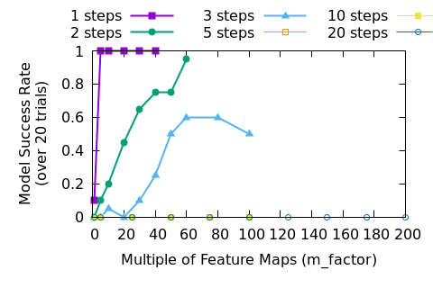
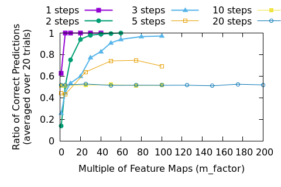

Large DNNs And Bad Local Minima
-------------------------------

This is a follow-up post to [Large DNNs Look Good, But They May Be Fooling Us](20230828-LargeDNNsLookGood--TheyMayBeFoolingUs.html).

In that post we looked at training a DNN to solve [Conway's Game of Life](https://en.wikipedia.org/wiki/Conway%27s_Game_of_Life) over different numbers of steps.

Let's look at the success results from the previous post. To refresh our memory, "success" means
that the DNN correctly predicted the dead or alive status for each cell after the given number of
steps, tested over 1000 5x5 initial states.

Let's spend a moment discussing how a deep neural network (DNN) "learns".

## What is "learning?"

When we talk about the learning process in a DNN, we are describing the way that weights and biases
are adjusted by stochastic gradient descent (SGD). Each variable that has some effect on the end
result shares some part of any error: this is called the "gradient." There are cases when the
gradient is 0, such as when a variable goes through a function that zeros the output, such as [ReLU](https://pytorch.org/docs/stable/generated/torch.nn.ReLU.html),
or when operations withing a network structure drop the gradients towards zero, called the [vanishing
gradient problem](https://en.wikipedia.org/wiki/Vanishing_gradient_problem).

We know that our DNNs are larger that strictly required to solve the problem where they are applied.
It is common to apply something like L1 or L2 loss to force some parameters to 0 and then prune them
after training so that the end result is a smaller network. A regularizer like dropout can
accomplish the same thing (I should make a post about this, but imagine a system with 2 inputs, one
of which is noisily correlated with the desired output and the other which can be used to derive the
output exactly--dropout can be used to force the weight of the noisy input to 0).

To get a "good" gradient, there must exist some parameters that have an output that is close to the
correct one such that a "path" over the loss surface (the loss values over different values of the
DNN's parameters) exists that is mostly downhill from the
starting point to the correct answer. Thus the parameters follow the gradient and "descend" into the
global minima of the loss.

But what if all of the parameters get into a position where going towards the correct answer
would make them go up hill? This is a local minima, and the networks that were being trained to
solve the game of life were certainly getting stuck in them.

For an example of a local minima, imagine that the DNN is detecting every single possible starting
configuration of `0`'s and `1`'s and mapping them, one by one, onto the correct outputs. There are
$2^9$ possible states in a `3x3` filter's receptive field, so that would take 2048 filters to brute
force.

Let's say that things don't go so badly and the weights of the corner positions, which are
uncorrelated with the desired output, go to `0` quickly. Now there are $2^5$ filters to find, which
is only 32. Let's say that the DNN quickly learns 30 of them--but there are only 30 filters in that
layer. The DNN will be stuck, because if it changes any of the existing filters it will get worse
and the loss will go up.
Each of the existing filters leads to a "correct" output $30/32$ times, so the training loss won't
pull them out of their current states. The DNN is now stuck in a local minima.

That isn't even a worst case--at least some of the outputs are correct. Imagine a case where the
gradient sometimes pulls values one way and sometimes pull them in another way, but never pulls very
strongly. Those parameters will get "stuck" because the loss surface is too flat. Now, if some of
the desired outputs are "solved" by other parameters the loss for those cases will go down, freeing
those parameters to move to solve the inputs that still lead to high loss, but one the DNN gets
stuck that can no longer happen.

This is perhaps difficult to visualize, so let's try to take a look at some real examples.

Each of the lines in Figures 3-6 show a walk from a known high quality solution (as described in the
[previous post](20230828-LargeDNNsLookGood--TheyMayBeFoolingUs.html)) to the solution found during
training. Since the loss surface has as many dimensions as there are parameters in the network it
isn't easy to visualize--but if you're a higher dimensional being you can think about it as a
multidimensional mountain range. Each of the lines on those figures represents a straight line walk
from one point to another along the loss surface. The peaks--those areas with extremely high loss--
separate the loss surface into discrete zones.

Some textbooks may pretend that a complicated route through several valleys will connect any
starting position, but that isn't true in this case and is very likely untrue in practice. The
initial starting position, the random initialization of the DNN's weights and biases, will determine
where training will converge.
On each figure you can see that several of the lines end up at nearly the same location, so training
can converge to the same (or nearly the same) solution. The important question is whether or not
that solution is any good.

Adding more parameters to the DNN smooths out the loss surface and may join some of
the loss valleys together. Smoothness helps, but it is still possible to get an unlucky
initialization of a network, which is probably why in practice we always train several networks for
a task rather than a single one. In academic papers we then report statistics and in industry we
select the best model for deployment. This is yet another overhead cost of the brute force approach
of current training techniques.

## Improving Results

A solution to this is unclear, at least to me. Replacing stochastic gradient descent with some
unknown magic would be nice, but the fact is that no human that I know of can cast spells. I can
suggest several realistic directions though.

First, we allow DNNs to give us bad answers. Maybe we should stop? When we put a
[softmax](https://pytorch.org/docs/stable/generated/torch.nn.functional.softmax.html) at the output
of our classifiers we force those outputs into a correct range, regardless of what nonsense is
coming out of the last layer of the network (a softmax converts its inputs so that they all sum to
1, as a probability should). This encourages strange behaviors and promotes "bag of features" type
responses. Most troubling, there is no possibility for the network to
output all `0`s when none of input's features correlate with any of the object classes. DNN
practitioners are well aware that the outputs of a softmax classifier can't be treated as real
probabilities, so a change in the outputs wouldn't actually cause much disruption.

<!-- mention GANs that generated arms attached to dumbells when the network was just supposed to
generate the dumbells -->

<!-- TODO Add in some random walks to show how the surface changes in different random directions.  -->

<!-- Summarize previous results -- larger networks seem to get better, but are very inefficient -->

<!-- talk about minima, global and local -->

<!-- itroduce the idea of a walk -->

<!-- plot some walks -->

<!-- try to initialize the middle of the network to the correct state, see what happens -->

<!-- probably need to present results for 10 or 20 steps. May need to add those to previous post too -->
