<!--
Abstract:

You may have heard that overfitting is a problem in machine learning. You may have even heard that regularization fixes the problem. But what is regularization?
Regularization techniques pre-date modern machine learning, including deep neural networks. Although deep neural networks are surprisingly robust to overfitting, regularization is still an essential part of neural network training. In this talk, we will look at overfitting and regularization in neural networks. How do they resist overfitting? What techniques can we use to regularize neural networks? What are some of the problems that regularization solves?
-->

# Regularization

## in Deep Neural Networks

Bernhard Firner

2025-03-10

---

## Some Prerequisites

* Going to assume that you know something about statistical modelling
  * e.g. you know about "curve fitting"
* Ideally, you know the components of an artificial neural network
* Examples will be in Python
  * Neural networking in PyTorch, but experience isn't required

---

## What is a Regularizer?

* Regularizers "simplify" statistical models
  * Reduce "overfitting" to noise in training
  * Improve generalization
* They've long been a part of statistical methods

---

## What is Overfitting

* A model can be fantastic on its training data and terrible elsewhere
* This failure to generalize is called overfitting
* Blamed on a model with too many parameters fitting both a signal and noise

\
<sub style="font-size: 0.6em">By Chabacano - Own work, CC BY-SA 4.0, https://commons.wikimedia.org/w/index.php?curid=3610704</sub>

---

## Regularization in Neural Networks

* Reuse some techniques from other statistical models
  * Often necessary, but often insufficient
* Neural networks are used in new tasks, so new regularizers were invented

But let's begin with something traditional.

---

## Least Squares Overfitting

```python [|9,14|]
import numpy

def sample_curve(offset, spread, magnitude, x):
    """Produce a curve."""
    return magnitude * 2**(-(x - offset)**2/spread)


# The x and y points along a curve
x_samples = [0.05 * x for x in range(21)]
y_samples = [sample_curve(0.5, 0.1, 1, x) for x in x_samples]

# The perfect solution to a noiseless set of points.
# We will solve with a as many coefficients as samples
A = numpy.vander(x_samples, N=20, increasing=True)
coef = numpy.linalg.lstsq(A, y_samples, rcond=-1)[0]
# Print out the samples and our fit line
print("x, y samples, fit")
# Also plot some extra points to see how the fit generalizes between the training points
x_samples = [0.025 * x for x in range(41)]
y_samples = [sample_curve(0.5, 0.1, 1, x) for x in x_samples]
for idx, point in enumerate(zip(x_samples, y_samples)):
    prediction = sum([c * point[0]**i for i, c in enumerate(coef)])
    print(f"{point[0]}, {point[1]}, {prediction}")
```

---

## Without Noise

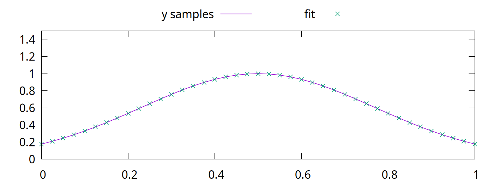

---

## Adding Noise

```python [|1,2|7|]
noise_generator = numpy.random.default_rng()
noise = numpy.random.standard_normal(len(y_samples)) * 0.05

# The perfect solution to a noiseless set of points.
# We will solve with a as many coefficients as samples
A = numpy.vander(x_samples, N=5, increasing=True)
coef = numpy.linalg.lstsq(A, y_samples + noise, rcond=-1)[0]
A_over = numpy.vander(x_samples, N=20, increasing=True)
coef_over = numpy.linalg.lstsq(A_over, y_samples + noise, rcond=-1)[0]
# Print out the samples and our fit line
print("x, y samples, y noise, fit, overfit")
# Also plot some extra points to see how the fit generalizes between the training points
x_samples = [0.025 * x for x in range(41)]
y_samples = [sample_curve(0.5, 0.1, 1, x) for x in x_samples]
for idx, point in enumerate(zip(x_samples, y_samples)):
    prediction = sum([c * point[0]**i for i, c in enumerate(coef)])
    overfit_prediction = sum([c * point[0]**i for i, c in enumerate(coef_over)])
    if idx % 2 == 0:
        print(f"{point[0]}, {point[1]}, {point[1] + noise[idx//2]}, {prediction}, {overfit_prediction}")
    else:
        print(f"{point[0]}, {point[1]}, none, {prediction}, {overfit_prediction}")
```

---

## Least Squares with Noise

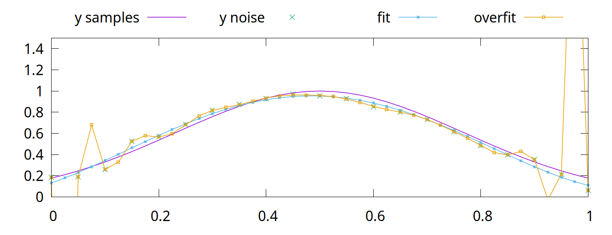

The "overfit" line comes from a solution with as many parameters as sample points.\
The "fit" line has a quarter as many parameters.

---

## Regularizers in Neural Networks

* Parameters vastly outnumber the problem dimension
  * So we should see the same overfitting problem, right?
  * Wrong!

-v-

## A Quick Primer on Linear NNs

* The basic building block of a neural network is an artificial neuron
  * Has a `weight`, $w$, for each of $k$ inputs
  * Also has a `bias`, $b$
  * Given input, $x_1$ ... $x_k$, the output is $b + \sum^k_{i=1}w_{i}x_i$
* A `linear layer` with $n$ outputs has $n$ neurons.
  * Each neuron in the layer uses the same inputs
  * Also called a `fully connected` layer
```torch
        torch.nn.Linear(1, 1000),
```

-v-

## Connecting Layers

* Linear layers can be directly connected
  * Experience shows this is not optimal
  * All outputs would be linear responses to the input
* Putting a `nonlinearity` between layers allows more complex functions
```python
net = torch.nn.Sequential(
        torch.nn.Linear(1, 1000),
        torch.nn.ReLU(),
        torch.nn.Linear(1000, 1000),
        torch.nn.ReLU(),
        torch.nn.Linear(1000, 1))
```

-v-

## ReLU

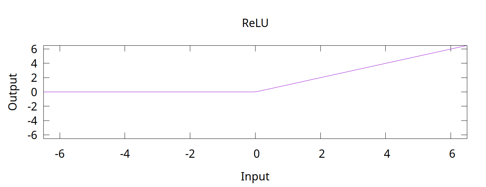

Rectified Linear Unit function

$f(x) = max(0, x)$

-v-

## Toy Example

```python
import torch

net = torch.nn.Sequential(
        # 2 inputs, 1 output
        torch.nn.Linear(2, 1),
        torch.nn.ReLU())

# We are directly changing the model parameters, so we need to tell PyTorch
# that we don't treat this as learning
with torch.no_grad():
    # There is one bias value in the first layer, since there is one output
    net[0].bias[0] = -1

    # There are two weights in the first layer, for the two inputs
    net[0].weight[0].fill_(0.5)

    # The network performs the operation f(a,b) = ReLU(-1 + 0.5a + 0.5b)
    print(f"f(1., 8.) = {net.forward(torch.tensor([1., 8.]))}")
    print(f"f(0., 0.) = {net.forward(torch.tensor([0., 0.]))}")
    print(f"f(4., -2.) = {net.forward(torch.tensor([4., -2.]))}")
    print(f"f(3., 3.) = {net.forward(torch.tensor([3., 3.]))}")
```
> f(1., 8.) = tensor([3.5000]) \
> f(0., 0.) = tensor([0.]) \
> f(4., -2.) = tensor([0.]) \
> f(3., 3.) = tensor([2.])

-v-

```python
import torch

net = torch.nn.Sequential(
        # 1 inputs, 2 output
        torch.nn.Linear(1, 2),
        torch.nn.ReLU(),
        # 2 inputs, 1 outputs
        torch.nn.Linear(2, 1))

# We are directly changing the model parameters, so we need to tell PyTorch
# that we don't treat this as learning
with torch.no_grad():
    # There are two bias values in the first layer, since there are two outputs
    net[0].bias[0] = 1
    net[0].bias[1] = -1

    # There are two weights in the first layer, for the two outputs
    # The first index of a linear layer's weights is the output number,
    # the second is the input number.
    net[0].weight[0,0] = 1
    net[0].weight[1,0] = 2

    # The first two layers of the network have two outputs:
    #  f_1(x) = ReLU(1 + x)
    #  f_2(x) = ReLU(-1 + 2x)

    # There is one bias value in the third layer, for the one output.
    net[2].bias[0] = 0.25

    # There are two weight values in the first layer, one for each input.
    net[2].weight[0,0] = 0.75
    net[2].weight[0,1] = -0.75

    # The network performs g(x) = 0.25 + 0.75f_1(x) - 0.75f_2(x)
    # g(x) = 0.25 + 0.75*RelU(1 + x) - 0.75*ReLU(-1 + 2x)

    for x in [-1 + inc*0.25 for inc in range(9)]:
        print(f"g({x}) = {net.forward(torch.tensor([x]))}")
```
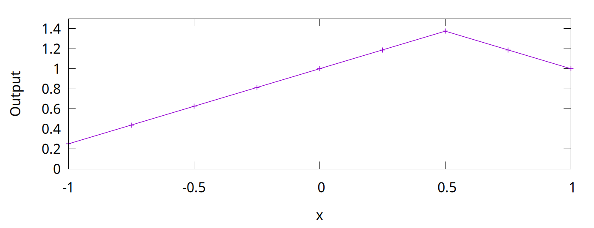

-v-

## Learning with Gradient Descent

* You typically train a neural network with pairs of inputs and outputs
* The error, or `loss`, is the difference between the network output and the desired output
* The loss function could be mean squared error, absolute error, or others
```python
loss_fn = torch.nn.MSELoss(reduction='sum')
```

-v-

## Loss

```python
    output = net.forward(x_inputs)
    loss = loss_fn(output, y_targets)
    loss.backward()
```
* The output calculation is called the `forward` pass
* In the `backward` pass, you assign a responsibility for the error to each weight and bias
  * This is called the `gradient`
  * Calculated via the derivative
  * [Wikipedia link on backpropagation](https://en.wikipedia.org/wiki/Backpropagation)

-v-

## Parameter Updates

* Once a gradient (blame) is assigned to all weight and bias values, they are updated
* Could be simple
  * multiplying all gradients by a constant and add to the parameters
    * The constant is called the `learning rate`
```python
    optimizer.zero_grad()
    output = net.forward(x_inputs)
    loss = loss_fn(output, y_targets)
    loss.backward()
    optimizer.step()
```

-v-

## Surprisingly Robust

<!-- TODO FIXME: Transition slide back to the main topic -->

---

## Really?

Let's take an example

```python []
# For better repeatability
torch.random.manual_seed(0)

net = torch.nn.Sequential(
        torch.nn.Linear(1, 1000),
        torch.nn.ReLU(),
        torch.nn.Linear(1000, 1000),
        torch.nn.ReLU(),
        torch.nn.Linear(1000, 1))
# Results are less predictable without momentum
optimizer = torch.optim.SGD(net.parameters(), lr=0.004, momentum=0.05)
loss_fn = torch.nn.MSELoss(reduction='sum')

net.train()

x_inputs = torch.tensor(x_samples).view((len(x_samples), 1))
y_targets = torch.tensor(y_samples).view((len(y_samples), 1))

# Train for 4000 steps
for step in range(4000):
    optimizer.zero_grad()
    output = net.forward(x_inputs)
    loss = loss_fn(output, y_targets)
    loss.backward()
    optimizer.step()
    # Note: We could stop early if we achieve good enough results
    # There is no harm is training for longer
    # if loss < 0.005:
    #     break

net.eval()

# Print out the samples and our predictions
print("x, y samples, y noise, prediction")
# Also plot some extra points to see how the fit generalizes between the training points
x_samples = [0.025 * x for x in range(41)]
y_samples = [sample_curve(0.5, 0.1, 1, x) for x in x_samples]
prediction = net(torch.tensor(x_samples).view((len(x_samples), 1))).flatten().tolist()
for idx, point in enumerate(zip(x_samples, y_samples)):
    if idx % 2 == 0:
        print(f"{point[0]}, {point[1]}, {point[1] + noise[idx//2]}, {prediction[idx]}")
    else:
        print(f"{point[0]}, {point[1]}, none, {prediction[idx]}")
```

---

## NN with Noisy Data

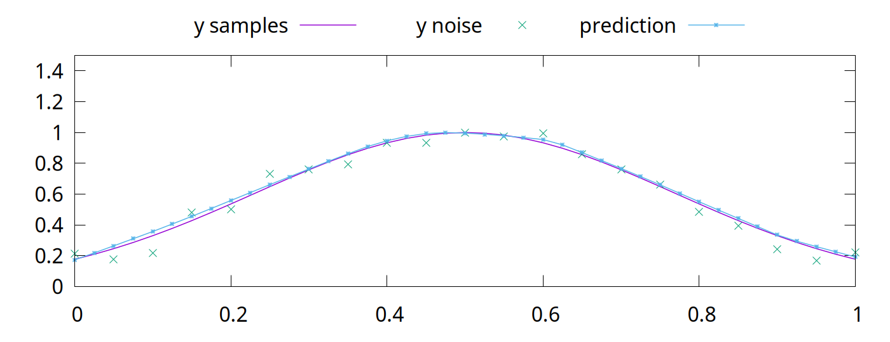

Magic!

---

## Why Does This Work?

* Short answer: *Gradient Descent* is *magic*
  * Longer answer is that success will vary:
    * with the kind of noise
    * with the task
  * Here, the local minima resists moving into a tortured function
    * Local minima is where the NN parameters get "stuck"
    * Non-optimal solution, but often simpler
    * The output is a piecewise linear fit with 1000 pieces, which is naturally smooth
<!-- Make a drop down slide to illustrate that mechanic -->
* Despite this success, regularizers are *vital* for deep learning

-v-

## Minima Details

<!-- TODO: Show how the model converges, show how the parameters get stuck -->

<!--

## Regularizers in DNNs

- What are they doing?
* What do they solve?
- How are they used?
-->
<!-- Not just noise -- also completely wrong data -->

---

## Deep Neural Networks

### (DNNs)

* Practitioners *do not* try to use smaller models
  * Instead, we (generally) use the largest model feasible
* Why?
  * Unexpectedly, larger models generalize better than smaller models
* Don't think this means that DNNs are *immune* to overfitting issues
\
\
\
Further reading: [The Loss Surfaces of Multilayer Networks](https://arxiv.org/abs/1412.0233)
<!-- Make a drop down with some images from Anna's paper -->

---

## Common Regularization Techniques

* L1 or L2 penalties
  * These penalize the network for having non-zero parameters
* Dropout
  * Portions of network layers are randomly ignored during training
* Stochastic Depth
  * Entire layers of the network are randomly ignored during training
* Label Smoothing
* Changing the learning target
  * For example, predict matrix transform parameters rather than pixel differences
  * Train large network on big datasets and use conditioning input to restrict output domains

---

## L2 Penalty: Motivations

L2 penalties simplify the output outside of our training range

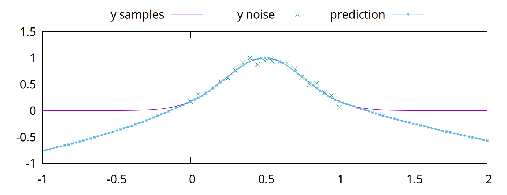

The previous model was trained without an L2 penalty.

---

## L2 Penalty Results

Results are improved outside of the training domain.

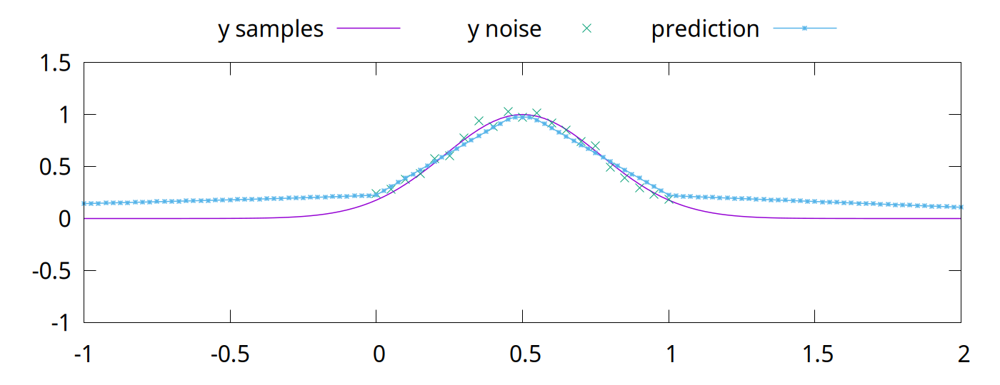

The L2 penalty has more utility than this.

<!-- TODO FIXME Add in a histogram of the weights with and without L2 -->

---

## L2 Penalty: Motivations Continued

Let's revisit curve fitting

We'll start with pre-solved parameters to demonstrate a worst-case outcome.

```python []
import math
import torch

def sample_curve(offset, spread, magnitude, x):
    """Produce a curve that looks like the overfitting example in "The Little Book of Deep Learning" by François Fleuret."""
    return magnitude * 2**(-(x - offset)**2/spread)


# The x and y points along a curve
x_samples = [0.2 * x for x in range(6)]
y_samples = [sample_curve(0.5, 0.1, 1, x) for x in x_samples]

################

# For better repeatability
torch.random.manual_seed(0)

net = torch.nn.Sequential(
        torch.nn.Linear(1, 6),
        torch.nn.ReLU(),
        torch.nn.Linear(6, 1))

# Instead of training the model, we will set the parameters so that the output
# intercepts each of the training points.

# This turns off gradient calculations since we aren't do learning.
with torch.no_grad():
    # Initialize all parameters to 0.
    net[0].bias.fill_(0.)
    net[0].weight.fill_(0.)
    net[2].bias.fill_(0.)
    net[2].weight.fill_(0.)

    # Remember the slopes for delta slope calculations
    slopes = [0.]

    # Set all other weight and bias values to handle slopes for the rest of the points
    for i in range(1, len(x_samples)):
        # Calculate the changes in slope required to go from one point to the next
        slope = (y_samples[i]-y_samples[i-1]) / (x_samples[i]-x_samples[i-1])
        slopes.append(slope)
        delta_slope = slopes[-1] - slopes[-2]
        # The weight for the next parameter will be the delta slope
        net[0].weight[i-1,0] = abs(delta_slope)
        # Set the bias value so that the output will be <0 before this training point
        net[0].bias[i-1] = -x_samples[i-1] * abs(delta_slope)
        # In the second linear layer, set the correct sign for the slope
        net[2].weight[0,i-1] = math.copysign(1, delta_slope)
    # Set the bias value to match the first y value of the training points
    net[2].bias[0] = y_samples[0]

net.eval()

# Print out the samples and our predictions
print("x, y samples, prediction")
# Also plot some extra points to see how the fit generalizes between the training points
x_samples = [0.025 * x for x in range(41)]
y_samples = [sample_curve(0.5, 0.1, 1, x) for x in x_samples]
prediction = net(torch.tensor(x_samples).view((len(x_samples), 1))).flatten().tolist()
for idx, point in enumerate(zip(x_samples, y_samples)):
    print(f"{point[0]}, {point[1]}, {prediction[idx]}")
```

---

## L2 Penalty: Motivations

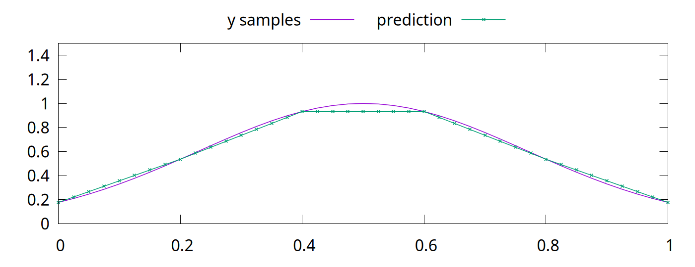

This verifies that we have a solution.

<!-- Also talk about pruning, maybe in a digression -->

-v-

## Compare with Trained Solution


6 neurons per layer instead of 1000.

---

## L2 Penalty: Motivations

The solution is at a minima, meaning the loss approaches 0.

```python []
# To check the error:
net.train()
loss_fn = torch.nn.MSELoss(reduction='sum')
x_inputs = torch.tensor(x_samples).view((len(x_samples), 1))
y_targets = torch.tensor(y_samples).view((len(y_samples), 1))
output = net.forward(x_inputs)
loss = loss_fn(output, y_targets)
print(f"Loss is {loss}")
```
Loss is 1.1013412404281553e-13

---

## L2 Continued: With Errors

We can make the network worse without changing the loss:

```python [17:]
# Larger model so we can insert errors
net = torch.nn.Sequential(
        torch.nn.Linear(1, 9),
        torch.nn.ReLU(),
        torch.nn.Linear(9, 1))
```

```python [51:]
    # Now add in an egregious error in the middle of the points
    error_begin = x_samples[2] + (x_samples[3] - x_samples[2])/5
    error_end = x_samples[3] - (x_samples[3] - x_samples[2])/5
    error_middle = (error_begin + error_end) / 2
    error_slope = 10
    # Go egregiously wrong between error_begin and error_end
    net[0].weight[-3] = error_slope
    net[0].bias[-3] = -error_begin * error_slope
    net[2].weight[0,-3] = 1
    # Now cancel the error slope by going back down at twice the rate
    net[0].weight[-2] = 2 * error_slope
    net[0].bias[-2] = -error_middle * 2 * error_slope
    net[2].weight[0,-2] = -1
    # Now cancel out what we've done so the slope is the same as before
    net[0].weight[-1] = error_slope
    net[0].bias[-1] = -error_end * error_slope
    net[2].weight[0,-1] = 1
```

---

## Will Gradient Descent Fix It?

No. The loss is fantastic.

```python []
net.train()
loss_fn = torch.nn.MSELoss(reduction='sum')
x_inputs = torch.tensor(x_samples).view((len(x_samples), 1))
y_targets = torch.tensor(y_samples).view((len(y_samples), 1))
output = net.forward(x_inputs)
loss = loss_fn(output, y_targets)
print(f"Initial loss is {loss}")
optimizer = torch.optim.SGD(net.parameters(), lr=0.004, momentum=0.05)
# Train for 4000 steps
for step in range(4000):
    optimizer.zero_grad()
    output = net.forward(x_inputs)
    loss = loss_fn(output, y_targets)
    loss.backward()
    # If you want to inspect the gradients:
    #if step == 0:
    #    print(f"Grads are {[p.grad for p in net.parameters()]}")
    optimizer.step()
print(f"Final loss is {loss}")
```
Initial loss is 2.8066438062523957e-13\
Final loss is 3.597122599785507e-14

---

## The Error Persists

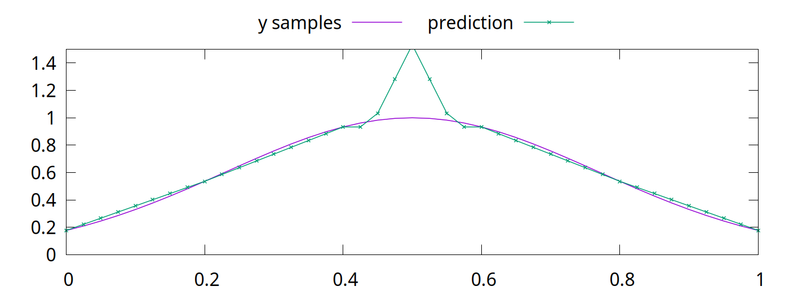

---

## The L2 Penalty

* Add the square of each weight in the network to the loss
* Formally:
  * $\sum^k_{i=1} w_{i}^2$
* The loss is the derivative of that:
  * $2\sum^k_{i=1} w_{i}$
* Multiply by a factor, $\alpha$

---

## Adding L2 to Our Loss

* Conceptually, just add the sum of the parameters to the loss
  * Logistically, PyTorch's optimizer does other things with the loss value
  * Momentum works on the loss value, for example.
* Pass $\alpha$ to the `weight_decay` option in PyTorch's SGD optimizer
  * We'll arbitrarily choose $\alpha = 0.08$
<!--
  * Note: technically, PyTorch's version is only $1/2$ L2
  * Makes little difference unless you are trying to exactly replicate something
* [Source code, for the curious.](https://github.com/pytorch/pytorch/blob/main/torch/optim/sgd.py)
-->

```python
optimizer = torch.optim.SGD(net.parameters(), lr=0.004, momentum=0.05, weight_decay=0.08)
```
New loss values:\
Initial loss is 2.8066438062523957e-13\
Final loss is 0.021319851279258728

---

## New Result

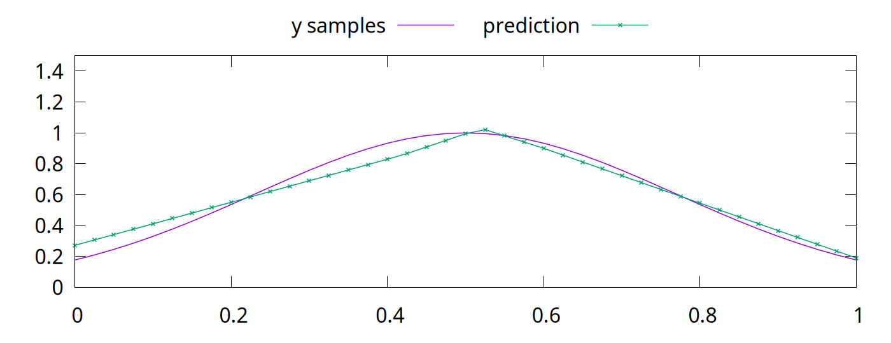

It isn't perfect, but it is an improvement.

This helps when training data is sparse and with out of domain data. What about biased data?

---

## Data Bias

Great example from [Google research](https://research.google/blog/inceptionism-going-deeper-into-neural-networks/) into neural network visualization in 2015:

> [T]his reveals that the neural net isn’t quite looking for the thing we thought it was. For example, here’s what one neural net we designed thought dumbbells looked like:


Arms are correlated with dumbbells, hence the confusion.

---

## Correlations

* DNNs mine for signals that are correlated with a desired output
  * e.g. eyes are correlated with faces
* Some correlations are weak, some are strong, and some are just spurious
* A hard problem; living creatures can be fooled by data bias as well

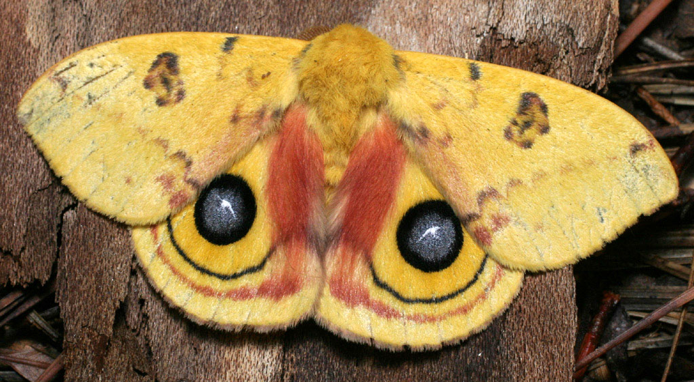
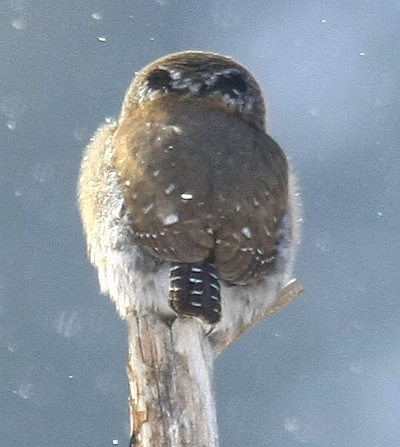

<sub style="font-size: 0.5em">By Patrick Coin (Patrick Coin) - Photograph taken by Patrick Coin, CC BY-SA 2.5, https://commons.wikimedia.org/w/index.php?curid=768361<br/>
By Tim from Ithaca - Northern Pygmy Owl, CC BY 2.0, https://commons.wikimedia.org/w/index.php?curid=96044504</sub>

---

## Dropout

* Different benefits have been ascribed to [Dropout](https://arxiv.org/abs/1207.0580)
  * Prevent "co-adaptation" of features
    * As per Hinton's 2012 paper and Alexnet
  * Create a superposition of smaller DNNs within a larger DNN
    * Comes with the same advantages as an ensemble
    * This is a more recent explanation
* Dropout makes models prefer stronger signals over weaker signals

---

<!-- for dropout, show example with incorrect correlation -- different kind of noise -->
<!-- Dropout works similarly to old genetic algorithms, with new networks "created" by dropping out portions of the entire pool of parameters. If a set of parameters is very highly correlated with the answer, those parameters "take over" the network. If a dropout creation is missing them, but all of the other weights are built around them, that pushes more weights to mimic the same features. Inefficient globally, but locally good. -->
<!-- See if you can extend that to an image example, where correlations are obvious. Can you show different activations in emnist models with and without dropout? -->

<!-- Talk about how it's the learning process rather than the architecture that is vital: convnext vs transformers -->

---

## Stochastic Depth


---

## Others

* Label Smoothing

---

## Is This Important?

* Machine learning is more accessible than ever
* Speed of progress comes with problems
  * Theory and practice have never been less documented
* Reading on your own, you may think that the newest DNN models are the best
* Experience and research show this is not the case

>   By itself, this enhanced training recipe increased the performance of the ResNet-50 model from 76.1% to 78.8%
(+2.7%), implying that a significant portion of the performance difference between traditional ConvNets and vision
Transformers may be due to the training techniques.

[A ConvNet for the 2020s](https://arxiv.org/abs/2201.03545)

---

## Takeaways

> Recent studies demonstrate that a set of
modern training techniques can significantly enhance the
performance of a simple ResNet-50 model. In our study,
we use a training recipe that is close to DeiT’s and
Swin Transformer’s. The training is extended to 300
epochs from the original 90 epochs for ResNets. We use the
AdamW optimizer, data augmentation techniques such
as Mixup, Cutmix, RandAugment, Random
Erasing, and regularization schemes including Stochastic Depth and Label Smoothing. The complete set
of hyper-parameters we use can be found in Appendix A.1.
By itself, this enhanced training recipe increased the performance of the ResNet-50 model from 76.1% to 78.8%
(+2.7%), implying that a significant portion of the performance difference between traditional ConvNets and vision
Transformers may be due to the training techniques.

[A ConvNet for the 2020s](https://arxiv.org/abs/2201.03545)

<!-- 

[More ConvNets in the 2020s: Scaling up Kernels Beyond 51x51 using Sparsity](https://arxiv.org/abs/2207.03620)

[ConvNeXt V2: Co-designing and Scaling ConvNets with Masked Autoencoders](https://arxiv.org/abs/2301.00808)
-->
