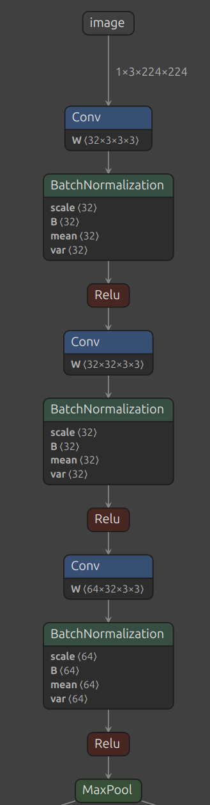

<!--
Abstract:

It's easy to get started with neural networks -- you can just download one and try it out!
From YOLO to Stable Diffusion, downloading and running a neural network locally is now something you can get working before lunch.
But what if you don't just want to run a model; what if you want good results?
-->

# So You've Downloaded a DNN

### Now What?

Bernhard Firner

2025-07-02

---

## Getting Started

* It's easy to download a DNN
* Doing something useful can be more difficult
* Some tips:
  * Don't be too ambitious
  * Start simple, avoid the cutting edge
  * Stay away from abandoned cdoe

---

## Avoid Starting from Scratch

* Training a DNN is harder than you think!
* Start with a pretrained model
  * Even if you need to train your own later!
  * Decouples DNN development from the rest of the project

---

## Pretrained Models

* First, what does pretrained mean?
  * It means you don't need to train the model
  * Saves lots of data, time, and cursing
* The end result of training is a bunch of numbers
  * The numbers are the parameters for some linear algebra
  * In the end, a DNN is just a *lot* of math

---

## Feeding Your Square Data Into a Round Model
* Downloading a model is easy; using it can be hard
* Your data (images, etc) may still need to be formatted
  * Cropping, scaling
  * Normalizing colors, converting to RGB, YUV, grayscale, etc
  * Selecting frames from a video
  * Selecting detection thresholds for your data
  * So many details
* A pretrained model lets you worry about your data first, model second


---

## Resnet Example

<style>
.container { display: flex; }
.col {flex: 1;}
</style>

<div class="container">
<div class="col">

* Model input is 3x224x224
  * 3 is the number of channels
    * RGB or YUV?
* Should the target be centered and cropped?
* Downscaled if it's too large?

</div>
<div class="col">


</div>
</div>

---

## More Complications

* What is the input image range?
  * \[0,1\]?
  * \[0,255\]?
  * \[-1,1\]?
  * If your input is wrong, you'll get crazy results!
* In many cases, inputs are set to 0 mean, and unit variance (= 1)
  * For each image, subtract the mean, and divide by the variance
  * Wait, which mean and variance?
    * Per image? Or from the training dataset?

---

## Don't Download Whatever!

* Some models may be harder to get working!
* The latest and greatest models also exist in vacuums
  * Each one you try will be in a separate repository
  * Try to get access to more models with less work!
* As an example, let's say you search for YOLO (You Only Look Once)

---

## Latest and Greatest

Top result on the day I searched\
[https://github.com/ultralytics/ultralytics](https://github.com/ultralytics/ultralytics)

<!--

-->


---

## More Modular

MMDetection is a group of many detection DNNs\
[https://github.com/open-mmlab/mmdetection](https://github.com/open-mmlab/mmdetection)


---

## Easiest to Use

Some DNNs are already integrated into OpenCV\
[https://github.com/opencv/opencv_zoo](https://github.com/opencv/opencv_zoo)


---

## What is OpenCV?

* Research quality computer vision toolbox
  * Good for prototyping and experimenting
  * Has some quirks, but they're well-documented
* Where you should start

---

## But I Want the Super Latest Most New Model that came out last week!!!!!

* No you don't

### But my advisor said I do!

* Don't start with it

---

## Why Not? Example

* YOLO does detection
* How well does it detect?
* Detection performance is measured with recall and precision
  * recall: ${True Positives} / {All Instances}$
  * precision: ${True Positives} / {All Positives}$
* Recall and precision are calculated per class
* Results across all classes are combined into a single metric called mAP

<!--
TODO FIXME Add in a pie chart for this
-->

---

## Latest and Greatest

* A paper is published when a model improves mAP by any amount
  * 0.2% improvement? Time to publish!
  * You probably don't even know what mAP is
  * $MAP = \frac{\sum^Q_{q=1}AveP(q)}{Q}$
    * AveP (Average Precision) is the area under the precision-recall curve
  * See [mAP][1]

[1]: https://en.wikipedia.org/wiki/Evaluation_measures_(information_retrieval)

---

## Worth It?

* Real world results won't change with 1% (or even 5%) improvements
  * Why? Because nothing is 100%
    * Error handling is inevitable
* How gracefully you handle errors will determine user experience

---

## Trying Some Examples

```
pip3 install opencv-python
```
* The `opencv-python` package will install the OpenCV binaries
* See the [package description](https://pypi.org/project/opencv-python)

---

## C++ Setup

[https://github.com/opencv/opencv](https://github.com/opencv/opencv)
* Follow the [OpenCV install docs](https://docs.opencv.org/4.x/d0/d3d/tutorial_general_install.html)

---

## Model Zoo

* Clone the model zoo [https://github.com/opencv/opencv_zoo](https://github.com/opencv/opencv_zoo)
  * There is no installation, the models are static files
* For example, YOLOX models are in opencv_zoo/models/object_detection_yolox
  * One is `object_detection_yolox_2022nov.onnx`
* [ONNX](https://onnx.ai) stands for "Open Neural Network eXchange"
  * Standard way to share model parameters

---

## Python Installation

### (Quick Version)

<!--<section style="text-align: left;">-->

```
sudo apt-get install git-lfs
pip3 install onnx
pip3 install opencv-python
git clone https://github.com/opencv/opencv_zoo
cd opencv_zoo
git lfs install
git lfs pull
```

---

## ONNX Models

* Popularized by, but separate from, PyTorch
  * Available in many languages
  * In Python, use the `onnx` and `onnxruntime` libraries
* Only for inference
* Can be faster than inference in PyTorch
  * especially on Arm devices (e.g. Raspberry Pi)
```
import onnx
import onnxruntime as ort
# Restore the traced graph
net = onnx.load(model_path)
onnx.checker.check_model(net)
# Prepare compute operations for your machine
inference = ort.InferenceSession(model_path)
# Get your input ready
output = inference.run(None, {'input1': input1, ...})
```

---

## Inspecting ONNX Models

* Use `netron` to view
  * `pip3 install netron`
* It serves a graph of the model as a web page

---

## YOLOX Begin


---

## YOLOX End


<!-- There are 80 classes but 85 outputs. 4 outputs are for the regression of the bounding box, one is for the box score, and the rest are classification.  -->

---

## Classification Example

See [opencv_zoo/models/image_classification_ppresnet/ppresnet.py](https://github.com/opencv/opencv_zoo/blob/main/models/image_classification_ppresnet/ppresnet.py)

```python [|26-28|46-50,57|]
# This file is part of OpenCV Zoo project.
# It is subject to the license terms in the LICENSE file found in the same directory.
#
# Copyright (C) 2021, Shenzhen Institute of Artificial Intelligence and Robotics for Society, all rights reserved.
# Third party copyrights are property of their respective owners.


import numpy as np
import cv2 as cv

class PPResNet:
    def __init__(self, modelPath, topK=1, loadLabel=True, backendId=0, targetId=0):
        self._modelPath = modelPath
        assert topK >= 1
        self._topK = topK
        self._load_label = loadLabel
        self._backendId = backendId
        self._targetId = targetId

        self._model = cv.dnn.readNet(self._modelPath)
        self._model.setPreferableBackend(self._backendId)
        self._model.setPreferableTarget(self._targetId)

        self._inputNames = ''
        self._outputNames = ['save_infer_model/scale_0.tmp_0']
        self._inputSize = [224, 224]
        self._mean = np.array([0.485, 0.456, 0.406])[np.newaxis, np.newaxis, :]
        self._std = np.array([0.229, 0.224, 0.225])[np.newaxis, np.newaxis, :]

        # load labels
        self._labels = self._load_labels()

    def _load_labels(self):
        return self.LABELS_IMAGENET_1K.splitlines()

    @property
    def name(self):
        return self.__class__.__name__

    def setBackendAndTarget(self, backendId, targetId):
        self._backendId = backendId
        self._targetId = targetId
        self._model.setPreferableBackend(self._backendId)
        self._model.setPreferableTarget(self._targetId)

    def _preprocess(self, image):
        image = image.astype(np.float32, copy=False) / 255.0
        image -= self._mean
        image /= self._std
        return cv.dnn.blobFromImage(image)

    def infer(self, image):
        assert image.shape[0] == self._inputSize[1], '{} (height of input image) != {} (preset height)'.format(image.shape[0], self._inputSize[1])
        assert image.shape[1] == self._inputSize[0], '{} (width of input image) != {} (preset width)'.format(image.shape[1], self._inputSize[0])

        # Preprocess
        inputBlob = self._preprocess(image)

        # Forward
        self._model.setInput(inputBlob, self._inputNames)
        outputBlob = self._model.forward(self._outputNames)

        # Postprocess
        results = self._postprocess(outputBlob[0])

        return results

    def _postprocess(self, outputBlob):
        batched_class_id_list = []
        for ob in outputBlob:
            class_id_list = ob.argsort()[::-1][:self._topK]
            batched_class_id_list.append(class_id_list)
        if len(self._labels) > 0 and self._load_label:
            batched_predicted_labels = []
            for class_id_list in batched_class_id_list:
                predicted_labels = []
                for class_id in class_id_list:
                    predicted_labels.append(self._labels[class_id])
                batched_predicted_labels.append(predicted_labels)
            return batched_predicted_labels
        else:
            return batched_class_id_list

    LABELS_IMAGENET_1K = '''tench
goldfish
great white shark
tiger shark
hammerhead
electric ray
stingray
cock
hen
ostrich
brambling
goldfinch
house finch
junco
indigo bunting
robin
bulbul
jay
magpie
chickadee
water ouzel
kite
bald eagle
vulture
great grey owl
European fire salamander
common newt
eft
spotted salamander
axolotl
bullfrog
tree frog
tailed frog
loggerhead
leatherback turtle
mud turtle
terrapin
box turtle
banded gecko
common iguana
American chameleon
whiptail
agama
frilled lizard
alligator lizard
Gila monster
green lizard
African chameleon
Komodo dragon
African crocodile
American alligator
triceratops
thunder snake
ringneck snake
hognose snake
green snake
king snake
garter snake
water snake
vine snake
night snake
boa constrictor
rock python
Indian cobra
green mamba
sea snake
horned viper
diamondback
sidewinder
trilobite
harvestman
scorpion
black and gold garden spider
barn spider
garden spider
black widow
tarantula
wolf spider
tick
centipede
black grouse
ptarmigan
ruffed grouse
prairie chicken
peacock
quail
partridge
African grey
macaw
sulphur-crested cockatoo
lorikeet
coucal
bee eater
hornbill
hummingbird
jacamar
toucan
drake
red-breasted merganser
goose
black swan
tusker
echidna
platypus
wallaby
koala
wombat
jellyfish
sea anemone
brain coral
flatworm
nematode
conch
snail
slug
sea slug
chiton
chambered nautilus
Dungeness crab
rock crab
fiddler crab
king crab
American lobster
spiny lobster
crayfish
hermit crab
isopod
white stork
black stork
spoonbill
flamingo
little blue heron
American egret
bittern
crane
limpkin
European gallinule
American coot
bustard
ruddy turnstone
red-backed sandpiper
redshank
dowitcher
oystercatcher
pelican
king penguin
albatross
grey whale
killer whale
dugong
sea lion
Chihuahua
Japanese spaniel
Maltese dog
Pekinese
Shih-Tzu
Blenheim spaniel
papillon
toy terrier
Rhodesian ridgeback
Afghan hound
basset
beagle
bloodhound
bluetick
black-and-tan coonhound
Walker hound
English foxhound
redbone
borzoi
Irish wolfhound
Italian greyhound
whippet
Ibizan hound
Norwegian elkhound
otterhound
Saluki
Scottish deerhound
Weimaraner
Staffordshire bullterrier
American Staffordshire terrier
Bedlington terrier
Border terrier
Kerry blue terrier
Irish terrier
Norfolk terrier
Norwich terrier
Yorkshire terrier
wire-haired fox terrier
Lakeland terrier
Sealyham terrier
Airedale
cairn
Australian terrier
Dandie Dinmont
Boston bull
miniature schnauzer
giant schnauzer
standard schnauzer
Scotch terrier
Tibetan terrier
silky terrier
soft-coated wheaten terrier
West Highland white terrier
Lhasa
flat-coated retriever
curly-coated retriever
golden retriever
Labrador retriever
Chesapeake Bay retriever
German short-haired pointer
vizsla
English setter
Irish setter
Gordon setter
Brittany spaniel
clumber
English springer
Welsh springer spaniel
cocker spaniel
Sussex spaniel
Irish water spaniel
kuvasz
schipperke
groenendael
malinois
briard
kelpie
komondor
Old English sheepdog
Shetland sheepdog
collie
Border collie
Bouvier des Flandres
Rottweiler
German shepherd
Doberman
miniature pinscher
Greater Swiss Mountain dog
Bernese mountain dog
Appenzeller
EntleBucher
boxer
bull mastiff
Tibetan mastiff
French bulldog
Great Dane
Saint Bernard
Eskimo dog
malamute
Siberian husky
dalmatian
affenpinscher
basenji
pug
Leonberg
Newfoundland
Great Pyrenees
Samoyed
Pomeranian
chow
keeshond
Brabancon griffon
Pembroke
Cardigan
toy poodle
miniature poodle
standard poodle
Mexican hairless
timber wolf
white wolf
red wolf
coyote
dingo
dhole
African hunting dog
hyena
red fox
kit fox
Arctic fox
grey fox
tabby
tiger cat
Persian cat
Siamese cat
Egyptian cat
cougar
lynx
leopard
snow leopard
jaguar
lion
tiger
cheetah
brown bear
American black bear
ice bear
sloth bear
mongoose
meerkat
tiger beetle
ladybug
ground beetle
long-horned beetle
leaf beetle
dung beetle
rhinoceros beetle
weevil
fly
bee
ant
grasshopper
cricket
walking stick
cockroach
mantis
cicada
leafhopper
lacewing
dragonfly
damselfly
admiral
ringlet
monarch
cabbage butterfly
sulphur butterfly
lycaenid
starfish
sea urchin
sea cucumber
wood rabbit
hare
Angora
hamster
porcupine
fox squirrel
marmot
beaver
guinea pig
sorrel
zebra
hog
wild boar
warthog
hippopotamus
ox
water buffalo
bison
ram
bighorn
ibex
hartebeest
impala
gazelle
Arabian camel
llama
weasel
mink
polecat
black-footed ferret
otter
skunk
badger
armadillo
three-toed sloth
orangutan
gorilla
chimpanzee
gibbon
siamang
guenon
patas
baboon
macaque
langur
colobus
proboscis monkey
marmoset
capuchin
howler monkey
titi
spider monkey
squirrel monkey
Madagascar cat
indri
Indian elephant
African elephant
lesser panda
giant panda
barracouta
eel
coho
rock beauty
anemone fish
sturgeon
gar
lionfish
puffer
abacus
abaya
academic gown
accordion
acoustic guitar
aircraft carrier
airliner
airship
altar
ambulance
amphibian
analog clock
apiary
apron
ashcan
assault rifle
backpack
bakery
balance beam
balloon
ballpoint
Band Aid
banjo
bannister
barbell
barber chair
barbershop
barn
barometer
barrel
barrow
baseball
basketball
bassinet
bassoon
bathing cap
bath towel
bathtub
beach wagon
beacon
beaker
bearskin
beer bottle
beer glass
bell cote
bib
bicycle-built-for-two
bikini
binder
binoculars
birdhouse
boathouse
bobsled
bolo tie
bonnet
bookcase
bookshop
bottlecap
bow
bow tie
brass
brassiere
breakwater
breastplate
broom
bucket
buckle
bulletproof vest
bullet train
butcher shop
cab
caldron
candle
cannon
canoe
can opener
cardigan
car mirror
carousel
carpenters kit
carton
car wheel
cash machine
cassette
cassette player
castle
catamaran
CD player
cello
cellular telephone
chain
chainlink fence
chain mail
chain saw
chest
chiffonier
chime
china cabinet
Christmas stocking
church
cinema
cleaver
cliff dwelling
cloak
clog
cocktail shaker
coffee mug
coffeepot
coil
combination lock
computer keyboard
confectionery
container ship
convertible
corkscrew
cornet
cowboy boot
cowboy hat
cradle
crane
crash helmet
crate
crib
Crock Pot
croquet ball
crutch
cuirass
dam
desk
desktop computer
dial telephone
diaper
digital clock
digital watch
dining table
dishrag
dishwasher
disk brake
dock
dogsled
dome
doormat
drilling platform
drum
drumstick
dumbbell
Dutch oven
electric fan
electric guitar
electric locomotive
entertainment center
envelope
espresso maker
face powder
feather boa
file
fireboat
fire engine
fire screen
flagpole
flute
folding chair
football helmet
forklift
fountain
fountain pen
four-poster
freight car
French horn
frying pan
fur coat
garbage truck
gasmask
gas pump
goblet
go-kart
golf ball
golfcart
gondola
gong
gown
grand piano
greenhouse
grille
grocery store
guillotine
hair slide
hair spray
half track
hammer
hamper
hand blower
hand-held computer
handkerchief
hard disc
harmonica
harp
harvester
hatchet
holster
home theater
honeycomb
hook
hoopskirt
horizontal bar
horse cart
hourglass
iPod
iron
jack-o-lantern
jean
jeep
jersey
jigsaw puzzle
jinrikisha
joystick
kimono
knee pad
knot
lab coat
ladle
lampshade
laptop
lawn mower
lens cap
letter opener
library
lifeboat
lighter
limousine
liner
lipstick
Loafer
lotion
loudspeaker
loupe
lumbermill
magnetic compass
mailbag
mailbox
maillot
maillot
manhole cover
maraca
marimba
mask
matchstick
maypole
maze
measuring cup
medicine chest
megalith
microphone
microwave
military uniform
milk can
minibus
miniskirt
minivan
missile
mitten
mixing bowl
mobile home
Model T
modem
monastery
monitor
moped
mortar
mortarboard
mosque
mosquito net
motor scooter
mountain bike
mountain tent
mouse
mousetrap
moving van
muzzle
nail
neck brace
necklace
nipple
notebook
obelisk
oboe
ocarina
odometer
oil filter
organ
oscilloscope
overskirt
oxcart
oxygen mask
packet
paddle
paddlewheel
padlock
paintbrush
pajama
palace
panpipe
paper towel
parachute
parallel bars
park bench
parking meter
passenger car
patio
pay-phone
pedestal
pencil box
pencil sharpener
perfume
Petri dish
photocopier
pick
pickelhaube
picket fence
pickup
pier
piggy bank
pill bottle
pillow
ping-pong ball
pinwheel
pirate
pitcher
plane
planetarium
plastic bag
plate rack
plow
plunger
Polaroid camera
pole
police van
poncho
pool table
pop bottle
pot
potters wheel
power drill
prayer rug
printer
prison
projectile
projector
puck
punching bag
purse
quill
quilt
racer
racket
radiator
radio
radio telescope
rain barrel
recreational vehicle
reel
reflex camera
refrigerator
remote control
restaurant
revolver
rifle
rocking chair
rotisserie
rubber eraser
rugby ball
rule
running shoe
safe
safety pin
saltshaker
sandal
sarong
sax
scabbard
scale
school bus
schooner
scoreboard
screen
screw
screwdriver
seat belt
sewing machine
shield
shoe shop
shoji
shopping basket
shopping cart
shovel
shower cap
shower curtain
ski
ski mask
sleeping bag
slide rule
sliding door
slot
snorkel
snowmobile
snowplow
soap dispenser
soccer ball
sock
solar dish
sombrero
soup bowl
space bar
space heater
space shuttle
spatula
speedboat
spider web
spindle
sports car
spotlight
stage
steam locomotive
steel arch bridge
steel drum
stethoscope
stole
stone wall
stopwatch
stove
strainer
streetcar
stretcher
studio couch
stupa
submarine
suit
sundial
sunglass
sunglasses
sunscreen
suspension bridge
swab
sweatshirt
swimming trunks
swing
switch
syringe
table lamp
tank
tape player
teapot
teddy
television
tennis ball
thatch
theater curtain
thimble
thresher
throne
tile roof
toaster
tobacco shop
toilet seat
torch
totem pole
tow truck
toyshop
tractor
trailer truck
tray
trench coat
tricycle
trimaran
tripod
triumphal arch
trolleybus
trombone
tub
turnstile
typewriter keyboard
umbrella
unicycle
upright
vacuum
vase
vault
velvet
vending machine
vestment
viaduct
violin
volleyball
waffle iron
wall clock
wallet
wardrobe
warplane
washbasin
washer
water bottle
water jug
water tower
whiskey jug
whistle
wig
window screen
window shade
Windsor tie
wine bottle
wing
wok
wooden spoon
wool
worm fence
wreck
yawl
yurt
web site
comic book
crossword puzzle
street sign
traffic light
book jacket
menu
plate
guacamole
consomme
hot pot
trifle
ice cream
ice lolly
French loaf
bagel
pretzel
cheeseburger
hotdog
mashed potato
head cabbage
broccoli
cauliflower
zucchini
spaghetti squash
acorn squash
butternut squash
cucumber
artichoke
bell pepper
cardoon
mushroom
Granny Smith
strawberry
orange
lemon
fig
pineapple
banana
jackfruit
custard apple
pomegranate
hay
carbonara
chocolate sauce
dough
meat loaf
pizza
potpie
burrito
red wine
espresso
cup
eggnog
alp
bubble
cliff
coral reef
geyser
lakeside
promontory
sandbar
seashore
valley
volcano
ballplayer
groom
scuba diver
rapeseed
daisy
yellow ladys slipper
corn
acorn
hip
buckeye
coral fungus
agaric
gyromitra
stinkhorn
earthstar
hen-of-the-woods
bolete
ear
toilet tissue'''
```

---

## Classification Example

See [opencv_zoo/models/image_classification_ppresnet/demo.py](https://github.com/opencv/opencv_zoo/blob/main/models/image_classification_ppresnet/demo.py)

```python [|52-56|]
# This file is part of OpenCV Zoo project.
# It is subject to the license terms in the LICENSE file found in the same directory.
#
# Copyright (C) 2021, Shenzhen Institute of Artificial Intelligence and Robotics for Society, all rights reserved.
# Third party copyrights are property of their respective owners.

import argparse

import numpy as np
import cv2 as cv

# Check OpenCV version
opencv_python_version = lambda str_version: tuple(map(int, (str_version.split("."))))
assert opencv_python_version(cv.__version__) >= opencv_python_version("4.10.0"), \
       "Please install latest opencv-python for benchmark: python3 -m pip install --upgrade opencv-python"

from ppresnet import PPResNet

# Valid combinations of backends and targets
backend_target_pairs = [
    [cv.dnn.DNN_BACKEND_OPENCV, cv.dnn.DNN_TARGET_CPU],
    [cv.dnn.DNN_BACKEND_CUDA,   cv.dnn.DNN_TARGET_CUDA],
    [cv.dnn.DNN_BACKEND_CUDA,   cv.dnn.DNN_TARGET_CUDA_FP16],
    [cv.dnn.DNN_BACKEND_TIMVX,  cv.dnn.DNN_TARGET_NPU],
    [cv.dnn.DNN_BACKEND_CANN,   cv.dnn.DNN_TARGET_NPU]
]

parser = argparse.ArgumentParser(description='Deep Residual Learning for Image Recognition (https://arxiv.org/abs/1512.03385, https://github.com/PaddlePaddle/PaddleHub)')
parser.add_argument('--input', '-i', type=str,
                    help='Usage: Set input path to a certain image, omit if using camera.')
parser.add_argument('--model', '-m', type=str, default='image_classification_ppresnet50_2022jan.onnx',
                    help='Usage: Set model path, defaults to image_classification_ppresnet50_2022jan.onnx.')
parser.add_argument('--backend_target', '-bt', type=int, default=0,
                    help='''Choose one of the backend-target pair to run this demo:
                        {:d}: (default) OpenCV implementation + CPU,
                        {:d}: CUDA + GPU (CUDA),
                        {:d}: CUDA + GPU (CUDA FP16),
                        {:d}: TIM-VX + NPU,
                        {:d}: CANN + NPU
                    '''.format(*[x for x in range(len(backend_target_pairs))]))
parser.add_argument('--top_k', type=int, default=1,
                    help='Usage: Get top k predictions.')
args = parser.parse_args()

if __name__ == '__main__':
    backend_id = backend_target_pairs[args.backend_target][0]
    target_id = backend_target_pairs[args.backend_target][1]
    top_k = args.top_k
    # Instantiate ResNet
    model = PPResNet(modelPath=args.model, topK=top_k, backendId=backend_id, targetId=target_id)

    # Read image and get a 224x224 crop from a 256x256 resized
    image = cv.imread(args.input)
    image = cv.cvtColor(image, cv.COLOR_BGR2RGB)
    image = cv.resize(image, dsize=(256, 256))
    image = image[16:240, 16:240, :]

    # Inference
    result = model.infer(image)[0]

    # Print result
    if top_k == 1:
        print(f"Predicted Label: {result[0]}")
    else:
        print("Predicted Top-K Labels (in decreasing confidence):")
        for i, prediction in enumerate(result):
            print(f"({i+1}) {prediction}")
```

---

## Detection Example

See [opencv_zoo/models/object_detection_yolox/yolox.py](https://github.com/opencv/opencv_zoo/blob/main/models/object_detection_yolox/yolox.py)
```python [|5,8-10|]
import numpy as np
import cv2

class YoloX:
    def __init__(self, modelPath, confThreshold=0.35, nmsThreshold=0.5, objThreshold=0.5, backendId=0, targetId=0):
        self.num_classes = 80
        self.net = cv2.dnn.readNet(modelPath)
        self.input_size = (640, 640)
        self.mean = np.array([0.485, 0.456, 0.406], dtype=np.float32).reshape(1, 1, 3)
        self.std = np.array([0.229, 0.224, 0.225], dtype=np.float32).reshape(1, 1, 3)
        self.strides = [8, 16, 32]
        self.confThreshold = confThreshold
        self.nmsThreshold = nmsThreshold
        self.objThreshold = objThreshold
        self.backendId = backendId
        self.targetId = targetId
        self.net.setPreferableBackend(self.backendId)
        self.net.setPreferableTarget(self.targetId)

        self.generateAnchors()

    @property
    def name(self):
        return self.__class__.__name__

    def setBackendAndTarget(self, backendId, targetId):
        self.backendId = backendId
        self.targetId = targetId
        self.net.setPreferableBackend(self.backendId)
        self.net.setPreferableTarget(self.targetId)

    def preprocess(self, img):
        blob = np.transpose(img, (2, 0, 1))
        return blob[np.newaxis, :, :, :]

    def infer(self, srcimg):
        input_blob = self.preprocess(srcimg)

        self.net.setInput(input_blob)
        outs = self.net.forward(self.net.getUnconnectedOutLayersNames())

        predictions = self.postprocess(outs[0])
        return predictions

    def postprocess(self, outputs):
        dets = outputs[0]

        dets[:, :2] = (dets[:, :2] + self.grids) * self.expanded_strides
        dets[:, 2:4] = np.exp(dets[:, 2:4]) * self.expanded_strides

        # get boxes
        boxes = dets[:, :4]
        boxes_xyxy = np.ones_like(boxes)
        boxes_xyxy[:, 0] = boxes[:, 0] - boxes[:, 2] / 2.
        boxes_xyxy[:, 1] = boxes[:, 1] - boxes[:, 3] / 2.
        boxes_xyxy[:, 2] = boxes[:, 0] + boxes[:, 2] / 2.
        boxes_xyxy[:, 3] = boxes[:, 1] + boxes[:, 3] / 2.

        # get scores and class indices
        scores = dets[:, 4:5] * dets[:, 5:]
        max_scores = np.amax(scores, axis=1)
        max_scores_idx = np.argmax(scores, axis=1)

        keep = cv2.dnn.NMSBoxesBatched(boxes_xyxy.tolist(), max_scores.tolist(), max_scores_idx.tolist(), self.confThreshold, self.nmsThreshold)

        candidates = np.concatenate([boxes_xyxy, max_scores[:, None], max_scores_idx[:, None]], axis=1)
        if len(keep) == 0:
            return np.array([])
        return candidates[keep]

    def generateAnchors(self):
        self.grids = []
        self.expanded_strides = []
        hsizes = [self.input_size[0] // stride for stride in self.strides]
        wsizes = [self.input_size[1] // stride for stride in self.strides]

        for hsize, wsize, stride in zip(hsizes, wsizes, self.strides):
            xv, yv = np.meshgrid(np.arange(hsize), np.arange(wsize))
            grid = np.stack((xv, yv), 2).reshape(1, -1, 2)
            self.grids.append(grid)
            shape = grid.shape[:2]
            self.expanded_strides.append(np.full((*shape, 1), stride))

        self.grids = np.concatenate(self.grids, 1)
        self.expanded_strides = np.concatenate(self.expanded_strides, 1)
```


---

## Detection Example

See [opencv_zoo/models/object_detection_yolox/demo.py](https://github.com/opencv/opencv_zoo/blob/main/models/object_detection_yolox/demo.py)
```python []
import numpy as np
import cv2 as cv
import argparse

# Check OpenCV version
opencv_python_version = lambda str_version: tuple(map(int, (str_version.split("."))))
assert opencv_python_version(cv.__version__) >= opencv_python_version("4.10.0"), \
       "Please install latest opencv-python for benchmark: python3 -m pip install --upgrade opencv-python"

from yolox import YoloX

# Valid combinations of backends and targets
backend_target_pairs = [
    [cv.dnn.DNN_BACKEND_OPENCV, cv.dnn.DNN_TARGET_CPU],
    [cv.dnn.DNN_BACKEND_CUDA,   cv.dnn.DNN_TARGET_CUDA],
    [cv.dnn.DNN_BACKEND_CUDA,   cv.dnn.DNN_TARGET_CUDA_FP16],
    [cv.dnn.DNN_BACKEND_TIMVX,  cv.dnn.DNN_TARGET_NPU],
    [cv.dnn.DNN_BACKEND_CANN,   cv.dnn.DNN_TARGET_NPU]
]

classes = ('person', 'bicycle', 'car', 'motorcycle', 'airplane', 'bus',
           'train', 'truck', 'boat', 'traffic light', 'fire hydrant',
           'stop sign', 'parking meter', 'bench', 'bird', 'cat', 'dog',
           'horse', 'sheep', 'cow', 'elephant', 'bear', 'zebra', 'giraffe',
           'backpack', 'umbrella', 'handbag', 'tie', 'suitcase', 'frisbee',
           'skis', 'snowboard', 'sports ball', 'kite', 'baseball bat',
           'baseball glove', 'skateboard', 'surfboard', 'tennis racket',
           'bottle', 'wine glass', 'cup', 'fork', 'knife', 'spoon', 'bowl',
           'banana', 'apple', 'sandwich', 'orange', 'broccoli', 'carrot',
           'hot dog', 'pizza', 'donut', 'cake', 'chair', 'couch',
           'potted plant', 'bed', 'dining table', 'toilet', 'tv', 'laptop',
           'mouse', 'remote', 'keyboard', 'cell phone', 'microwave',
           'oven', 'toaster', 'sink', 'refrigerator', 'book', 'clock',
           'vase', 'scissors', 'teddy bear', 'hair drier', 'toothbrush')

def letterbox(srcimg, target_size=(640, 640)):
    padded_img = np.ones((target_size[0], target_size[1], 3)).astype(np.float32) * 114.0
    ratio = min(target_size[0] / srcimg.shape[0], target_size[1] / srcimg.shape[1])
    resized_img = cv.resize(
        srcimg, (int(srcimg.shape[1] * ratio), int(srcimg.shape[0] * ratio)), interpolation=cv.INTER_LINEAR
    ).astype(np.float32)
    padded_img[: int(srcimg.shape[0] * ratio), : int(srcimg.shape[1] * ratio)] = resized_img

    return padded_img, ratio

def unletterbox(bbox, letterbox_scale):
    return bbox / letterbox_scale

def vis(dets, srcimg, letterbox_scale, fps=None):
    res_img = srcimg.copy()

    if fps is not None:
        fps_label = "FPS: %.2f" % fps
        cv.putText(res_img, fps_label, (10, 25), cv.FONT_HERSHEY_SIMPLEX, 1, (0, 0, 255), 2)

    for det in dets:
        box = unletterbox(det[:4], letterbox_scale).astype(np.int32)
        score = det[-2]
        cls_id = int(det[-1])

        x0, y0, x1, y1 = box

        text = '{}:{:.1f}%'.format(classes[cls_id], score * 100)
        font = cv.FONT_HERSHEY_SIMPLEX
        txt_size = cv.getTextSize(text, font, 0.4, 1)[0]
        cv.rectangle(res_img, (x0, y0), (x1, y1), (0, 255, 0), 2)
        cv.rectangle(res_img, (x0, y0 + 1), (x0 + txt_size[0] + 1, y0 + int(1.5 * txt_size[1])), (255, 255, 255), -1)
        cv.putText(res_img, text, (x0, y0 + txt_size[1]), font, 0.4, (0, 0, 0), thickness=1)

    return res_img

if __name__=='__main__':
    parser = argparse.ArgumentParser(description='Nanodet inference using OpenCV an contribution by Sri Siddarth Chakaravarthy part of GSOC_2022')
    parser.add_argument('--input', '-i', type=str,
                        help='Path to the input image. Omit for using default camera.')
    parser.add_argument('--model', '-m', type=str, default='object_detection_yolox_2022nov.onnx',
                        help="Path to the model")
    parser.add_argument('--backend_target', '-bt', type=int, default=0,
                    help='''Choose one of the backend-target pair to run this demo:
                        {:d}: (default) OpenCV implementation + CPU,
                        {:d}: CUDA + GPU (CUDA),
                        {:d}: CUDA + GPU (CUDA FP16),
                        {:d}: TIM-VX + NPU,
                        {:d}: CANN + NPU
                    '''.format(*[x for x in range(len(backend_target_pairs))]))
    parser.add_argument('--confidence', default=0.5, type=float,
                        help='Class confidence')
    parser.add_argument('--nms', default=0.5, type=float,
                        help='Enter nms IOU threshold')
    parser.add_argument('--obj', default=0.5, type=float,
                        help='Enter object threshold')
    parser.add_argument('--save', '-s', action='store_true',
                        help='Specify to save results. This flag is invalid when using camera.')
    parser.add_argument('--vis', '-v', action='store_true',
                        help='Specify to open a window for result visualization. This flag is invalid when using camera.')
    args = parser.parse_args()

    backend_id = backend_target_pairs[args.backend_target][0]
    target_id = backend_target_pairs[args.backend_target][1]

    model_net = YoloX(modelPath= args.model,
                      confThreshold=args.confidence,
                      nmsThreshold=args.nms,
                      objThreshold=args.obj,
                      backendId=backend_id,
                      targetId=target_id)

    tm = cv.TickMeter()
    tm.reset()
    if args.input is not None:
        image = cv.imread(args.input)
        input_blob = cv.cvtColor(image, cv.COLOR_BGR2RGB)
        input_blob, letterbox_scale = letterbox(input_blob)

        # Inference
        tm.start()
        preds = model_net.infer(input_blob)
        tm.stop()
        print("Inference time: {:.2f} ms".format(tm.getTimeMilli()))

        img = vis(preds, image, letterbox_scale)

        if args.save:
            print('Results saved to result.jpg\n')
            cv.imwrite('result.jpg', img)

        if args.vis:
            cv.namedWindow(args.input, cv.WINDOW_AUTOSIZE)
            cv.imshow(args.input, img)
            cv.waitKey(0)

    else:
        print("Press any key to stop video capture")
        deviceId = 0
        cap = cv.VideoCapture(deviceId)

        while cv.waitKey(1) < 0:
            hasFrame, frame = cap.read()
            if not hasFrame:
                print('No frames grabbed!')
                break

            input_blob = cv.cvtColor(frame, cv.COLOR_BGR2RGB)
            input_blob, letterbox_scale = letterbox(input_blob)

            # Inference
            tm.start()
            preds = model_net.infer(input_blob)
            tm.stop()

            img = vis(preds, frame, letterbox_scale, fps=tm.getFPS())

            cv.imshow("YoloX Demo", img)

            tm.reset()
```

---

## Segmentation Example

See [opencv_zoo/models/image_segmentation_efficientsam/efficientSAM.py](https://github.com/opencv/opencv_zoo/models/image_segmentation_efficientsam/efficientSAM.py)

```python []
import argparse
import numpy as np
import cv2 as cv
from efficientSAM import EfficientSAM

# Check OpenCV version
opencv_python_version = lambda str_version: tuple(map(int, (str_version.split("."))))
assert opencv_python_version(cv.__version__) >= opencv_python_version("4.10.0"), \
       "Please install latest opencv-python for benchmark: python3 -m pip install --upgrade opencv-python"

# Valid combinations of backends and targets
backend_target_pairs = [
    [cv.dnn.DNN_BACKEND_OPENCV, cv.dnn.DNN_TARGET_CPU],
    [cv.dnn.DNN_BACKEND_CUDA,   cv.dnn.DNN_TARGET_CUDA],
    [cv.dnn.DNN_BACKEND_CUDA,   cv.dnn.DNN_TARGET_CUDA_FP16],
    [cv.dnn.DNN_BACKEND_TIMVX,  cv.dnn.DNN_TARGET_NPU],
    [cv.dnn.DNN_BACKEND_CANN,   cv.dnn.DNN_TARGET_NPU]
]

parser = argparse.ArgumentParser(description='EfficientSAM Demo')
parser.add_argument('--input', '-i', type=str,
                    help='Set input path to a certain image.')
parser.add_argument('--model', '-m', type=str, default='image_segmentation_efficientsam_ti_2024may.onnx',
                    help='Set model path, defaults to image_segmentation_efficientsam_ti_2024may.onnx.')
parser.add_argument('--backend_target', '-bt', type=int, default=0,
                    help='''Choose one of the backend-target pair to run this demo:
                        {:d}: (default) OpenCV implementation + CPU,
                        {:d}: CUDA + GPU (CUDA),
                        {:d}: CUDA + GPU (CUDA FP16),
                        {:d}: TIM-VX + NPU,
                        {:d}: CANN + NPU
                    '''.format(*[x for x in range(len(backend_target_pairs))]))
parser.add_argument('--save', '-s', action='store_true',
                    help='Specify to save a file with results. Invalid in case of camera input.')
args = parser.parse_args()

#global click listener
clicked_left = False
#global point record in the window
point = []

def visualize(image, result):
    """
    Visualize the inference result on the input image.

    Args:
        image (np.ndarray): The input image.
        result (np.ndarray): The inference result.

    Returns:
        vis_result (np.ndarray): The visualized result.
    """
    # get image and mask
    vis_result = np.copy(image)
    mask = np.copy(result)
    # change mask to binary image
    t, binary = cv.threshold(mask, 127, 255, cv.THRESH_BINARY)
    assert set(np.unique(binary)) <= {0, 255}, "The mask must be a binary image"
    # enhance red channel to make the segmentation more obviously
    enhancement_factor = 1.8
    red_channel = vis_result[:, :, 2]
    # update the channel
    red_channel = np.where(binary == 255, np.minimum(red_channel * enhancement_factor, 255), red_channel)
    vis_result[:, :, 2] = red_channel

    # draw borders
    contours, hierarchy = cv.findContours(binary, cv.RETR_LIST, cv.CHAIN_APPROX_TC89_L1)
    cv.drawContours(vis_result, contours, contourIdx = -1, color = (255,255,255), thickness=2)
    return vis_result

def select(event, x, y, flags, param):
    global clicked_left
    # When the left mouse button is pressed, record the coordinates of the point where it is pressed
    if event == cv.EVENT_LBUTTONUP:
        point.append([x,y])
        print("point:",point[0])
        clicked_left = True

if __name__ == '__main__':
    backend_id = backend_target_pairs[args.backend_target][0]
    target_id = backend_target_pairs[args.backend_target][1]
    # Load the EfficientSAM model
    model = EfficientSAM(modelPath=args.model)

    if args.input is not None:
        # Read image
        image = cv.imread(args.input)
        if image is None:
            print('Could not open or find the image:', args.input)
            exit(0)
        # create window
        image_window = "image: click on the thing whick you want to segment!"
        cv.namedWindow(image_window, cv.WINDOW_NORMAL)
        # change window size
        cv.resizeWindow(image_window, 800 if image.shape[0] > 800 else image.shape[0], 600 if image.shape[1] > 600 else image.shape[1])
        # put the window on the left of the screen
        cv.moveWindow(image_window, 50, 100)
        # set listener to record user's click point
        cv.setMouseCallback(image_window, select)
        # tips in the terminal
        print("click the picture on the LEFT and see the result on the RIGHT!")
        # show image
        cv.imshow(image_window, image)
        # waiting for click
        while cv.waitKey(1) == -1 or clicked_left:
            # receive click
            if clicked_left:
                # put the click point (x,y) into the model to predict
                result = model.infer(image=image, points=point, labels=[1])
                # get the visualized result
                vis_result = visualize(image, result)
                # create window to show visualized result
                cv.namedWindow("vis_result", cv.WINDOW_NORMAL)
                cv.resizeWindow("vis_result", 800 if vis_result.shape[0] > 800 else vis_result.shape[0], 600 if vis_result.shape[1] > 600 else vis_result.shape[1])
                cv.moveWindow("vis_result", 851, 100)
                cv.imshow("vis_result", vis_result)
                # set click false to listen another click
                clicked_left = False
            elif cv.getWindowProperty(image_window, cv.WND_PROP_VISIBLE) < 1:
                # if click × to close the image window then ending
                break
            else:
                # when not clicked, set point to empty
                point = []
        cv.destroyAllWindows()

        # Save results if save is true
        if args.save:
            cv.imwrite('./example_outputs/vis_result.jpg', vis_result)
            cv.imwrite("./example_outputs/mask.jpg", result)
            print('vis_result.jpg and mask.jpg are saved to ./example_outputs/')


    else:
        print('Set input path to a certain image.')
        pass
```

---

## Segmentation Example

See [opencv_zoo/models/image_segmentation_efficientsam/demo.py](https://github.com/opencv/opencv_zoo/models/image_segmentation_efficientsam/demo.py)

```python []
import argparse
import numpy as np
import cv2 as cv
from efficientSAM import EfficientSAM

# Check OpenCV version
opencv_python_version = lambda str_version: tuple(map(int, (str_version.split("."))))
assert opencv_python_version(cv.__version__) >= opencv_python_version("4.10.0"), \
       "Please install latest opencv-python for benchmark: python3 -m pip install --upgrade opencv-python"

# Valid combinations of backends and targets
backend_target_pairs = [
    [cv.dnn.DNN_BACKEND_OPENCV, cv.dnn.DNN_TARGET_CPU],
    [cv.dnn.DNN_BACKEND_CUDA,   cv.dnn.DNN_TARGET_CUDA],
    [cv.dnn.DNN_BACKEND_CUDA,   cv.dnn.DNN_TARGET_CUDA_FP16],
    [cv.dnn.DNN_BACKEND_TIMVX,  cv.dnn.DNN_TARGET_NPU],
    [cv.dnn.DNN_BACKEND_CANN,   cv.dnn.DNN_TARGET_NPU]
]

parser = argparse.ArgumentParser(description='EfficientSAM Demo')
parser.add_argument('--input', '-i', type=str,
                    help='Set input path to a certain image.')
parser.add_argument('--model', '-m', type=str, default='image_segmentation_efficientsam_ti_2024may.onnx',
                    help='Set model path, defaults to image_segmentation_efficientsam_ti_2024may.onnx.')
parser.add_argument('--backend_target', '-bt', type=int, default=0,
                    help='''Choose one of the backend-target pair to run this demo:
                        {:d}: (default) OpenCV implementation + CPU,
                        {:d}: CUDA + GPU (CUDA),
                        {:d}: CUDA + GPU (CUDA FP16),
                        {:d}: TIM-VX + NPU,
                        {:d}: CANN + NPU
                    '''.format(*[x for x in range(len(backend_target_pairs))]))
parser.add_argument('--save', '-s', action='store_true',
                    help='Specify to save a file with results. Invalid in case of camera input.')
args = parser.parse_args()

#global click listener
clicked_left = False
#global point record in the window
point = []

def visualize(image, result):
    """
    Visualize the inference result on the input image.

    Args:
        image (np.ndarray): The input image.
        result (np.ndarray): The inference result.

    Returns:
        vis_result (np.ndarray): The visualized result.
    """
    # get image and mask
    vis_result = np.copy(image)
    mask = np.copy(result)
    # change mask to binary image
    t, binary = cv.threshold(mask, 127, 255, cv.THRESH_BINARY)
    assert set(np.unique(binary)) <= {0, 255}, "The mask must be a binary image"
    # enhance red channel to make the segmentation more obviously
    enhancement_factor = 1.8
    red_channel = vis_result[:, :, 2]  
    # update the channel
    red_channel = np.where(binary == 255, np.minimum(red_channel * enhancement_factor, 255), red_channel)
    vis_result[:, :, 2] = red_channel  
    
    # draw borders
    contours, hierarchy = cv.findContours(binary, cv.RETR_LIST, cv.CHAIN_APPROX_TC89_L1)
    cv.drawContours(vis_result, contours, contourIdx = -1, color = (255,255,255), thickness=2)
    return vis_result

def select(event, x, y, flags, param):
    global clicked_left
    # When the left mouse button is pressed, record the coordinates of the point where it is pressed
    if event == cv.EVENT_LBUTTONUP:
        point.append([x,y])
        print("point:",point[0])
        clicked_left = True

if __name__ == '__main__':
    backend_id = backend_target_pairs[args.backend_target][0]
    target_id = backend_target_pairs[args.backend_target][1]
    # Load the EfficientSAM model
    model = EfficientSAM(modelPath=args.model)

    if args.input is not None:
        # Read image
        image = cv.imread(args.input)
        if image is None:
            print('Could not open or find the image:', args.input)
            exit(0)
        # create window
        image_window = "image: click on the thing whick you want to segment!"
        cv.namedWindow(image_window, cv.WINDOW_NORMAL)
        # change window size
        cv.resizeWindow(image_window, 800 if image.shape[0] > 800 else image.shape[0], 600 if image.shape[1] > 600 else image.shape[1])
        # put the window on the left of the screen
        cv.moveWindow(image_window, 50, 100)
        # set listener to record user's click point
        cv.setMouseCallback(image_window, select)
        # tips in the terminal
        print("click the picture on the LEFT and see the result on the RIGHT!")
        # show image
        cv.imshow(image_window, image)
        # waiting for click
        while cv.waitKey(1) == -1 or clicked_left:
            # receive click
            if clicked_left:
                # put the click point (x,y) into the model to predict
                result = model.infer(image=image, points=point, labels=[1])
                # get the visualized result
                vis_result = visualize(image, result)
                # create window to show visualized result
                cv.namedWindow("vis_result", cv.WINDOW_NORMAL)
                cv.resizeWindow("vis_result", 800 if vis_result.shape[0] > 800 else vis_result.shape[0], 600 if vis_result.shape[1] > 600 else vis_result.shape[1])
                cv.moveWindow("vis_result", 851, 100)
                cv.imshow("vis_result", vis_result)
                # set click false to listen another click
                clicked_left = False
            elif cv.getWindowProperty(image_window, cv.WND_PROP_VISIBLE) < 1: 
                # if click × to close the image window then ending
                break
            else:
                # when not clicked, set point to empty
                point = []
        cv.destroyAllWindows()
        
        # Save results if save is true
        if args.save:
            cv.imwrite('./example_outputs/vis_result.jpg', vis_result)
            cv.imwrite("./example_outputs/mask.jpg", result)
            print('vis_result.jpg and mask.jpg are saved to ./example_outputs/')

        
    else:
        print('Set input path to a certain image.')
        pass
```

---

## Tracking Example

```python []
# This file is part of OpenCV Zoo project.
# It is subject to the license terms in the LICENSE file found in the same directory.

import numpy as np
import cv2 as cv

class VitTrack:
    def __init__(self, model_path, backend_id=0, target_id=0):
        self.model_path = model_path
        self.backend_id = backend_id
        self.target_id = target_id

        self.params = cv.TrackerVit_Params()
        self.params.net = self.model_path
        self.params.backend = self.backend_id
        self.params.target = self.target_id

        self.model = cv.TrackerVit_create(self.params)

    @property
    def name(self):
        return self.__class__.__name__

    def setBackendAndTarget(self, backend_id, target_id):
        self.backend_id = backend_id
        self.target_id = target_id

        self.params.backend = self.backend_id
        self.params.target = self.target_id

        self.model = cv.TrackerVit_create(self.params)

    def init(self, image, roi):
        self.model.init(image, roi)

    def infer(self, image):
        is_located, bbox = self.model.update(image)
        score = self.model.getTrackingScore()
        return is_located, bbox, score
```

---

## Tracking Example

```python []
# This file is part of OpenCV Zoo project.
# It is subject to the license terms in the LICENSE file found in the same directory.

import argparse

import numpy as np
import cv2 as cv

# Check OpenCV version
opencv_python_version = lambda str_version: tuple(map(int, (str_version.split("."))))
assert opencv_python_version(cv.__version__) >= opencv_python_version("4.10.0"), \
       "Please install latest opencv-python for benchmark: python3 -m pip install --upgrade opencv-python"

from vittrack import VitTrack

# Valid combinations of backends and targets
backend_target_pairs = [
    [cv.dnn.DNN_BACKEND_OPENCV, cv.dnn.DNN_TARGET_CPU],
    [cv.dnn.DNN_BACKEND_CUDA,   cv.dnn.DNN_TARGET_CUDA],
    [cv.dnn.DNN_BACKEND_CUDA,   cv.dnn.DNN_TARGET_CUDA_FP16],
    [cv.dnn.DNN_BACKEND_TIMVX,  cv.dnn.DNN_TARGET_NPU],
    [cv.dnn.DNN_BACKEND_CANN,   cv.dnn.DNN_TARGET_NPU]
]

parser = argparse.ArgumentParser(
    description="VIT track opencv API")
parser.add_argument('--input', '-i', type=str,
                    help='Usage: Set path to the input video. Omit for using default camera.')
parser.add_argument('--model_path', type=str, default='object_tracking_vittrack_2023sep.onnx',
                    help='Usage: Set model path')
parser.add_argument('--backend_target', '-bt', type=int, default=0,
                    help='''Choose one of the backend-target pair to run this demo:
                        {:d}: (default) OpenCV implementation + CPU,
                        {:d}: CUDA + GPU (CUDA),
                        {:d}: CUDA + GPU (CUDA FP16),
                        {:d}: TIM-VX + NPU,
                        {:d}: CANN + NPU
                    '''.format(*[x for x in range(len(backend_target_pairs))]))
parser.add_argument('--save', '-s', action='store_true', default=False,
                    help='Usage: Specify to save a file with results.')
parser.add_argument('--vis', '-v', action='store_true', default=True,
                    help='Usage: Specify to open a new window to show results.')
args = parser.parse_args()
def visualize(image, bbox, score, isLocated, fps=None, box_color=(0, 255, 0),text_color=(0, 255, 0), fontScale = 1, fontSize = 1):
    output = image.copy()
    h, w, _ = output.shape

    if fps is not None:
        cv.putText(output, 'FPS: {:.2f}'.format(fps), (0, 30), cv.FONT_HERSHEY_DUPLEX, fontScale, text_color, fontSize)

    if isLocated and score >= 0.3:
        # bbox: Tuple of length 4
        x, y, w, h = bbox
        cv.rectangle(output, (x, y), (x+w, y+h), box_color, 2)
        cv.putText(output, '{:.2f}'.format(score), (x, y+25), cv.FONT_HERSHEY_DUPLEX, fontScale, text_color, fontSize)
    else:
        text_size, baseline = cv.getTextSize('Target lost!', cv.FONT_HERSHEY_DUPLEX, fontScale, fontSize)
        text_x = int((w - text_size[0]) / 2)
        text_y = int((h - text_size[1]) / 2)
        cv.putText(output, 'Target lost!', (text_x, text_y), cv.FONT_HERSHEY_DUPLEX, fontScale, (0, 0, 255), fontSize)

    return output

if __name__ == '__main__':
    backend_id = backend_target_pairs[args.backend_target][0]
    target_id = backend_target_pairs[args.backend_target][1]

    model = VitTrack(
        model_path=args.model_path,
        backend_id=backend_id,
        target_id=target_id)

    # Read from args.input
    _input = 0 if args.input is None else args.input
    video = cv.VideoCapture(_input)

    # Select an object
    has_frame, first_frame = video.read()
    if not has_frame:
        print('No frames grabbed!')
        exit()
    first_frame_copy = first_frame.copy()
    cv.putText(first_frame_copy, "1. Drag a bounding box to track.", (0, 25), cv.FONT_HERSHEY_SIMPLEX, 1, (0, 255, 0))
    cv.putText(first_frame_copy, "2. Press ENTER to confirm", (0, 50), cv.FONT_HERSHEY_SIMPLEX, 1, (0, 255, 0))
    roi = cv.selectROI('VitTrack Demo', first_frame_copy)

    if np.all(np.array(roi) == 0):
        print("No ROI is selected! Exiting ...")
        exit()
    else:
        print("Selected ROI: {}".format(roi))

    if args.save:
        fps = video.get(cv.CAP_PROP_FPS)
        frame_size = (first_frame.shape[1], first_frame.shape[0])
        output_video = cv.VideoWriter('output.mp4', cv.VideoWriter_fourcc(*'mp4v'), fps, frame_size)

    # Init tracker with ROI
    model.init(first_frame, roi)

    # Track frame by frame
    tm = cv.TickMeter()
    while cv.waitKey(1) < 0:
        has_frame, frame = video.read()
        if not has_frame:
            print('End of video')
            break
        # Inference
        tm.start()
        isLocated, bbox, score = model.infer(frame)
        tm.stop()
        # Visualize
        frame = visualize(frame, bbox, score, isLocated, fps=tm.getFPS())
        if args.save:
            output_video.write(frame)

        if args.vis:
            cv.imshow('VitTrack Demo', frame)
        tm.reset()

    if args.save:
        output_video.release()

    video.release()
    cv.destroyAllWindows()
```

---

## Advice

* Start with these examples
  * even if you are going to use something else
* For your work
  * Plug other models into this framework
  * Use the demos as working reference points

---

## More Topics

* You need to add new classes
  * This means retraining!
  * Possibly some data collection!
* You need something completely new
  * This means starting from data collection!
  * Also labelling!
  * Also deciding on training targets. Oh no!
