<!--
Abstract:

It's easy to get started with neural networks -- you can just download one and try it out!
From YOLO to Stable Diffusion, downloading and running a neural network locally is now something you can get working before lunch.
But what if you don't just want to run a model; what if you want good results?
-->

# Repurposing a DNN

## Semi-Custom Solutions

Bernhard Firner

2025-07-03

---

## Some problems are new

* You can't download something that "just works" because you need to
  * detect or track a new object
  * distinguish between different types of an existing object class
  * and so on
* That doesn't mean you need to start from scratch

---

## Walk Before Running

* Re-used code is the best code, re-used models are the best models
  * So try using a pretrained DNNs for your tasks!
* This talk:
  * don't start from scratch
  * save a ton of time and effort with re-use
  * innovate with existing models to create new applications

---

## Why Reuse a DNN?

* There are plenty of pretrained DNNs available
* Limited by the available datasets
  * Good for classifying people and toilet seats
  * Can be bad for new objects
  * Bad for esoteric items or traits
  * Bad for distinguishing subsets

---

## Widely Accepted Idea

<!--<section style="text-align: left;">-->

* Use a ten year old solution
  1. Download the biggest DNN trained on similar data
  2. Cut off the end of the DNN
  3. Train a new classifier using the DNN features

---

## Magic?

<style>
.container { display: flex; }
.col {flex: 1;}
</style>

<div class="container">
<div class="col">

* Old NNs (like LeNet) had distinct sections
  * Convolutions in the beginning
    * Break image features into semantic features
  * Linear layers at the end
    * Pulled features apart for classification
* LeNet, fyi, was used to read zip codes in the 90's

</div>
<div class="col">
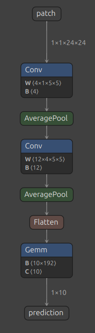
<!--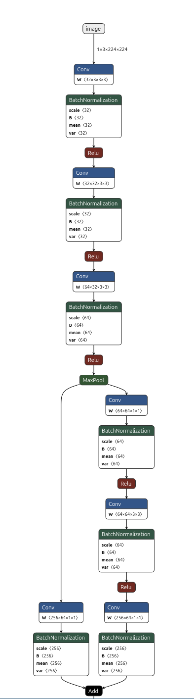-->
</div>
</div>

---

## LeNet 5 (1998)

[1998 paper](https://proceedings.neurips.cc/paper/1989/hash/53c3bce66e43be4f209556518c2fcb54-Abstract.html)

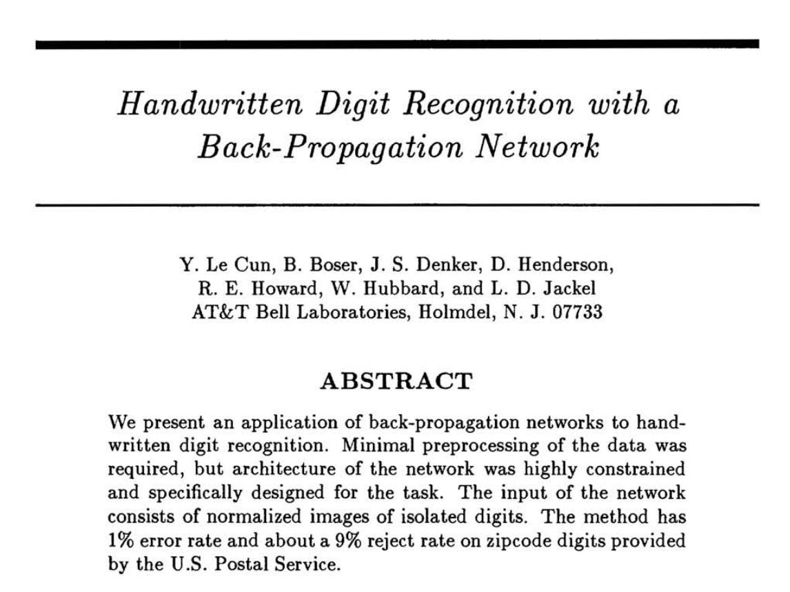

---

## What's a feature?

* Low level features come from early convolutions
  * Could be lines: vertical, horizontal, diagonal
  * Could be textures: hard, soft
* High Level, semantic features are more abstract
  * e.g. an eye or a specific material or quality
* Intuitively, these can be used to detect different objects

---

## Example features


<style>
.container { display: flex; }
.col {flex: 1;}
</style>

<div class="container">
<div class="col">

</div>
<div class="col">
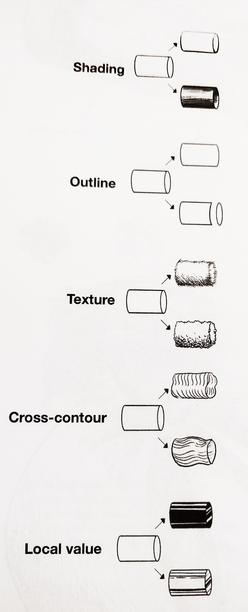
</div>
</div>

---

## Filters and features

```python []
#!/usr/bin/python3

# This code runs a provided filter over an image and saves the output.

import argparse

import numpy
import cv2

if __name__ == '__main__':
    parser = argparse.ArgumentParser(
        description="Convolution demo.")
    parser.add_argument(
        '--image_path',
        required=True,
        type=str,
        help='Path to an image file')
    parser.add_argument(
        '--outpath',
        type=str,
        default="filtered.png",
        help='Path to save the filtered image')
    parser.add_argument(
        '--filter',
        required=True,
        nargs=9,
        type=float,
        help='A 3x3 filter with 9 values')
    args = parser.parse_args()

    kernel = numpy.array(args.filter).reshape((3,3))

    image = cv2.imread(args.image_path)
    if image is None:
        print("Failed to load image.")
        exit()

    # Filter and keep the output depth the same
    filtered = cv2.filter2D(src=image, ddepth=-1, kernel=kernel)
    cv2.imwrite(args.outpath, filtered)
```

<!--
Due to some bug, a second code block is needed for mkslides to copy images over.
```python []
```
-->

---

## Feature and filter examples

<style>
.centered { text-align: center; margin-left: auto; margin-right: auto; }
.container { display: flex; }
.col {flex: 1;}
</style>

<div class="container">
<div class="col">

Filter

<table class="centered">
<tr>
  <th>1</th> <th>1</th> <th>1</th>
</tr>
<tr>
  <th>0</th> <th>0</th> <th>0</th>
</tr>
<tr>
  <th>-1</th> <th>-1</th> <th>-1</th>
</tr>
</table>

</div>
<div class="col">

</div>
</div>


---

## Feature and filter examples

<style>
.centered { text-align: center; margin-left: auto; margin-right: auto; }
.container { display: flex; }
.col {flex: 1;}
</style>

<div class="container">
<div class="col">

Filter

<table class="centered">
<tr>
  <th>-1</th> <th>0</th> <th>1</th>
</tr>
<tr>
  <th>-1</th> <th>0</th> <th>1</th>
</tr>
<tr>
  <th>-1</th> <th>0</th> <th>1</th>
</tr>
</table>

</div>
<div class="col">

</div>
</div>

---

## Feature and filter examples

<style>
.centered { text-align: center; margin-left: auto; margin-right: auto; }
.container { display: flex; }
.col {flex: 1;}
</style>

<div class="container">
<div class="col">

Filter

<table class="centered">
<tr>
  <th>0</th> <th>1</th> <th>0</th>
</tr>
<tr>
  <th>-1</th> <th>0</th> <th>1</th>
</tr>
<tr>
  <th>0</th> <th>-1</th> <th>0</th>
</tr>
</table>

</div>
<div class="col">

</div>
</div>

---

## Feature and filter examples

<style>
.centered { text-align: center; margin-left: auto; margin-right: auto; }
.container { display: flex; }
.col {flex: 1;}
</style>

<div class="container">
<div class="col">

Filter

<table class="centered">
<tr>
  <th>0</th> <th>1</th> <th>0</th>
</tr>
<tr>
  <th>1</th> <th>0</th> <th>-1</th>
</tr>
<tr>
  <th>0</th> <th>-1</th> <th>0</th>
</tr>
</table>

</div>
<div class="col">

</div>
</div>

---

## Feature discovery

* Nothing "justifies" a filter
  * Other than training data and statistics
* Humans hand-crafted features for years, with okay results
* Neural networks discover them through gradient descent
  * Known since the 80s and 90s

---

## Features from LeNet

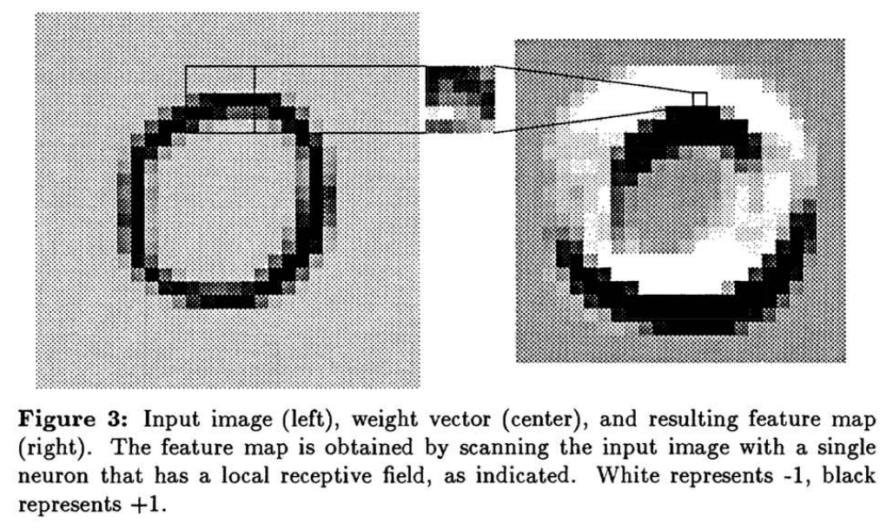

---

## Features from LeNet

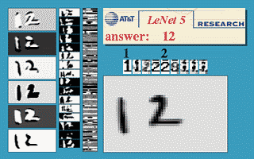

---

## Features from LeNet

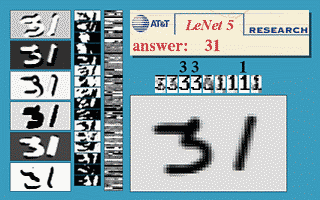

---

## Features from LeNet

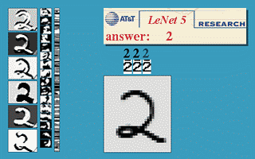

---

## Universal Features

* Serendipitously, NN discovered features appear to be universal
  * Robust to new types of noise
  * Meaning that they apply to almost any object type
  * The power of statistics!
* Chopping off the linear layers leaves a model that outputs features
* It's easy to re-use those to detect new classes
  * It was once popular to combine Support Vector Machines (SVMs) with NN features for classification

---

## Support Vector Machines (1995)

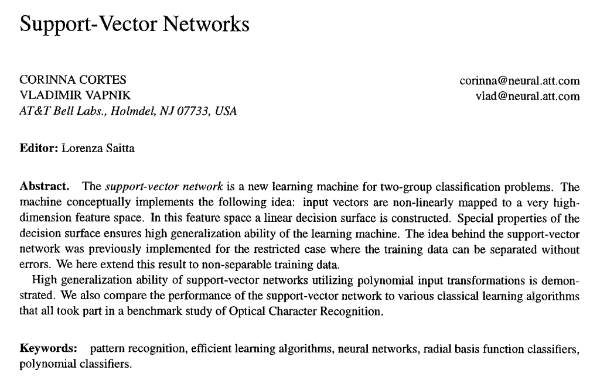

---

## SVM "Optimality"

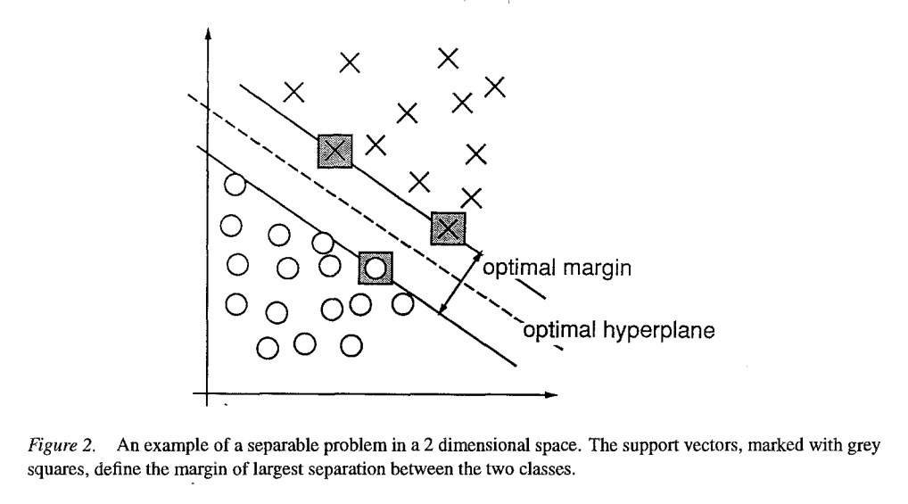

---

## SVM Hyperplanes

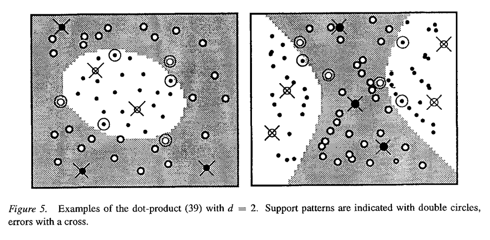

---

## Experience Learning Features

* NNs proved to be better at learning features
  * Training techniques have come a long way
  * So has compute power
* SVMs still have attractive qualities
  * small training data requirements
  * robust to noise within that data
* Using a NN to project features into 2D space works

---

## Recent DNNs are more complicated

* Some recent models are not straightforward like LeNet
  * Are simple features gradually converted to high-level ones?
* But we don't need to use newest models
  * Older models trained on older datasets can be fine
* There are also simpler models trained on recent data
  * For example, a mobile-friendly model

---

## Working with SVMs

* Available in scikit python package:
  * `pip3 install scikit-learn`
* Need a set of positive and negative examples

---

## Example: ten second detection and tracking

Labelling

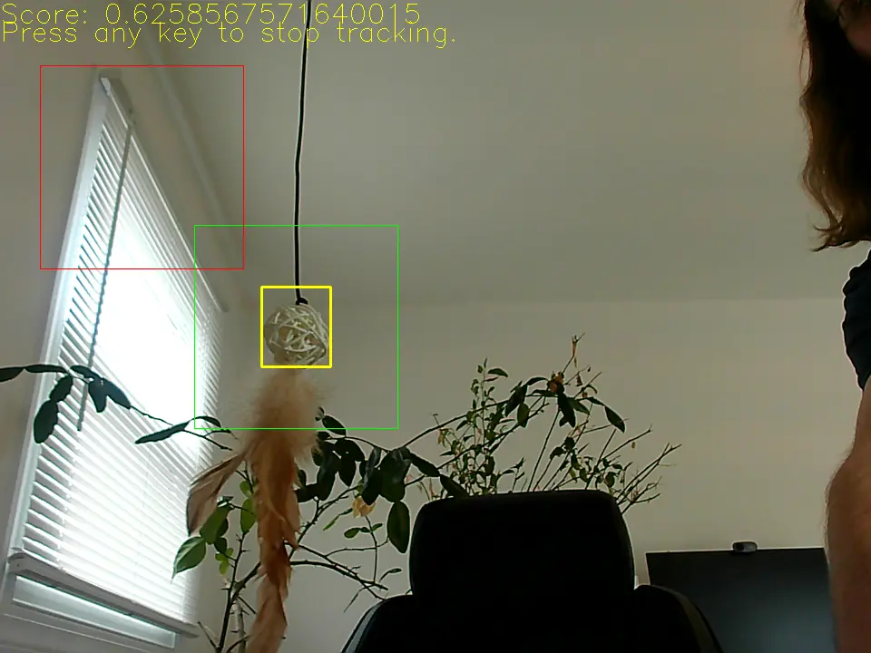

---

## Example: ten second detection and tracking

Detection

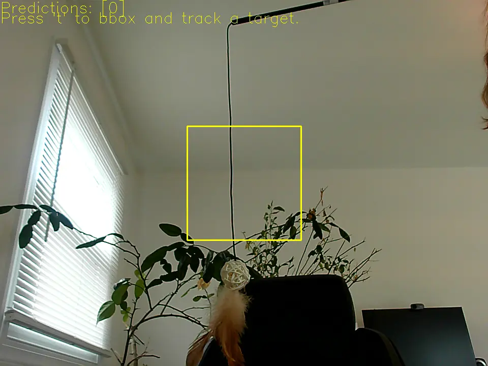

---

## Example: ten second detection and tracking

Tracking

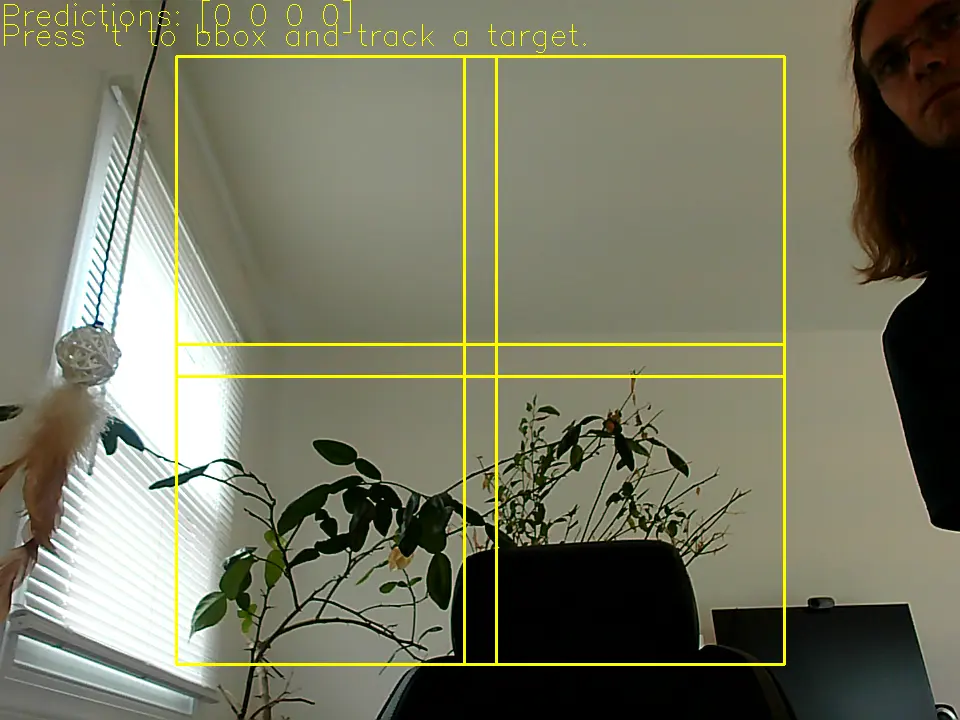

---

## Example: instant detection and tracking

```python []
#!/usr/bin/python3

# This is an example demonstrating the reuse of a model as a feature extractor.
# This demo covers dataset collection, SVM training, object detection, and object tracking.

import argparse

import numpy
import cv2

from sklearn import svm

# Check OpenCV version
opencv_python_version = lambda str_version: tuple(map(int, (str_version.split("."))))
assert opencv_python_version(cv2.__version__) >= opencv_python_version("4.10.0"), \
       "Please install latest opencv-python for benchmark: python3 -m pip install --upgrade opencv-python"
cv_version = cv2.__version__.split('.')[:2]
if cv_version[0] != "4" or int(cv_version[1]) < 10:
    print("This requires openCV version >= 4.10")
    quit(0)


class Vectorizer:
    """This class encapsulates model inference to extract a feature vector."""
    def __init__(self, model):
        self._model = cv2.dnn.readNet(model)
        self._input_names = ''
        # These are the features rather than the classes (which are in scale_0.tmp_0)
        self._output_names = ['save_infer_model/scale_1.tmp_0']
        self._expected_dim = 224
        # Images must be preprocessed in the same manner that they were trained
        # These constants are used for normalization. The means are suspect as
        # we are using a different camera, but we'll just hope it works.
        self._mean = numpy.array([[[0.485, 0.456, 0.406]]])
        self._std = numpy.array([[[0.229, 0.224, 0.225]]])

    def inDim(self):
        return self._expected_dim

    def getFeatures(self, image):
        # TODO FIXME Work on a batch of inputs
        image = cv2.cvtColor(image, cv2.COLOR_BGR2RGB)
        # TODO FIXME This is the default processing, but let's allow the user to do some of this
        w, h, _ = image.shape
        if w != self._expected_dim or h != self._expected_dim:
            image = cv2.resize(image, dsize=(self._expected_dim, self._expected_dim))

        # Inputs should be floats in the range [0,1]
        image = (image.astype(numpy.float32, copy=False) / 255.0 - self._mean) / self._std
        input_blob = cv2.dnn.blobFromImage(image)
        self._model.setInput(input_blob, self._input_names)
        features = self._model.forward(self._output_names)
        return features


def run_demo():
    """Demo data collection, object detection, and tracking with a simple GUI."""
    parser = argparse.ArgumentParser(
        description="VIT dataset labeller")
    parser.add_argument(
        '--vit_model',
        type=str,
        default='object_tracking_vittrack_2023sep.onnx',
        help='Path to the vit model')
    parser.add_argument(
        '--class_model',
        type=str,
        default='image_classification_ppresnet50_2022jan.onnx',
        help='Path to the classifying model.')
    args = parser.parse_args()

    # Initialize the tracking model
    params = cv2.TrackerVit_Params()
    params.net = args.vit_model
    tracker = cv2.TrackerVit_create(params)

    # Initialize the classifier.
    # It has fewer convenience wrappers, so we made our own.
    vectorizer = Vectorizer(args.class_model)

    # Some display constants
    text_yellow=(0, 255, 255)
    text_blue=(255, 0, 0)
    text_green=(0, 255, 0)
    text_red=(0, 0, 255)


    # Open the webcam
    video = cv2.VideoCapture(0)

    # Check and set some properties
    # See the OpenCV docs for a list of properties:
    # https://docs.opencv.org/4.11.0/d4/d15/group__videoio__flags__base.html#gaeb8dd9c89c10a5c63c139bf7c4f5704d
    # or samples in OpenCV repository: python/samples/video.py and python/samples/video_v4l2.py
    vid_width = video.get(cv2.CAP_PROP_FRAME_WIDTH)
    vid_height = video.get(cv2.CAP_PROP_FRAME_HEIGHT)
    # Sample bboxes will be 224 pixels wide. We want to always be able to fit two 224x224 boxes in an image,
    # so set a minimum frame size of 960x720 pixels
    if vid_height < 720:
        video.set(cv2.CAP_PROP_FRAME_WIDTH, 960)
        video.set(cv2.CAP_PROP_FRAME_HEIGHT, 720)
    vid_width = int(video.get(cv2.CAP_PROP_FRAME_WIDTH))
    vid_height = int(video.get(cv2.CAP_PROP_FRAME_HEIGHT))

    # Remember the current UI state.
    # waiting: the user needs to draw a bounding box and start training
    # tracking: vit is being used to track and label new data
    # classifying_fixed: classifying with the SVM, using a single box
    # classifying_search: classifying with the SVM, using a search grid to find the object
    # classifying_track: classifying with the SVM, tracking the object
    # quitting: the user wants to exit
    mode = "waiting"

    # OpenCV's waitKey function returns not just the key, but also any keyboard modifiers. This
    # means that the returned value cannot be compared to just the key.
    def isKey(cvkey, key):
        return key == (cvkey & 0xFF)

    # Keep going until capture fails or the user quits
    has_frame, frame = video.read()

    positive_examples = []
    negative_examples = []

    if not has_frame:
        print("Capture failures, exiting!")
        exit(1)

    while mode != "quitting" and has_frame:
        display_frame = frame.copy()
        #frame_h, frame_w, _ = display_frame.shape
        if mode == "waiting":
            cv2.putText(display_frame, "Press 't' to bbox and track a target.", (0, 25), cv2.FONT_HERSHEY_SIMPLEX, 1, text_yellow)
        elif mode == "tracking":
            found, foundbbox = tracker.update(frame)
            score = tracker.getTrackingScore()

            if found:
                x, y, w, h = foundbbox
                cv2.rectangle(display_frame, (x, y), (x+w, y+h), text_yellow, 2)
                cv2.putText(display_frame, f"Score: {score}", (0, 25), cv2.FONT_HERSHEY_SIMPLEX, 1, text_yellow)
                cv2.putText(display_frame, "Press any key to stop tracking.", (0, 45), cv2.FONT_HERSHEY_SIMPLEX, 1, text_yellow)

                # Add the found area to the positive examples and select something else for a negative example
                # We don't need to store the images, only the feature vectors
                # Sizes must be 224 by 224 or they will be resized
                # TODO FIXME Make 224x224 boxes with a positive and negative example
                left = x
                top = y
                if w < vectorizer.inDim():
                    # Widen the bbox
                    extra = vectorizer.inDim() - w
                    left = x - extra//2
                if left < 0:
                    left = 0
                if h < vectorizer.inDim():
                    # Heighten the bbox
                    extra = vectorizer.inDim() - h
                    top = top - extra//2
                if top < 0:
                    top = 0
                # TODO FIXME If they are wider than the inDim, use cv2.resize
                cv2.rectangle(display_frame, (left, top), (left+vectorizer.inDim(), top+vectorizer.inDim()), text_green, 1)
                positive_image = frame[top:top+vectorizer.inDim(), left:left+vectorizer.inDim(), :]
                # Remember this positive example
                positive_examples.append(vectorizer.getFeatures(positive_image)[0].flatten())
                # Won't need the image anymore
                del positive_image

                # Make a negative example from a different part of the image
                if w < vid_width/2 or h < vid_height/2:
                    # Try to fit to the left of the object with a 20 pixel buffer.
                    # Go to the right if there is no room.
                    if x > vectorizer.inDim() + 20:
                        nright = x - 20
                        nleft = nright - vectorizer.inDim()
                    else:
                        nleft = x + w + 20
                        nright = nleft + vectorizer.inDim()
                    # Try to fit above the object, but go below if there is no room.
                    if y > vectorizer.inDim() + 20:
                        nbottom = y - 20
                        ntop = nbottom - vectorizer.inDim()
                    else:
                        ntop = y + h + 20
                        nbottom = ntop + vectorizer.inDim()
                    # With some very wide or tall bounding boxes, we may still be outside of the image
                    # It's okay so long as one of the dimensions allows us to avoid the positive example
                    if nright < vid_width or nbottom < vid_height:
                        if nright >= vid_width:
                            # We can fit below the positive example
                            nright = vid_width - 1
                            nleft = nright - vectorizer.inDim()
                        if nbottom >= vid_height:
                            # We can fit below the positive example
                            nbottom = vid_height - 1
                            ntop = nbottom - vectorizer.inDim()

                        cv2.rectangle(display_frame, (nleft, ntop), (nright, nbottom), text_red, 1)
                        negative_image = frame[ntop:nbottom, nleft:nright, :]
                        negative_examples.append(vectorizer.getFeatures(negative_image)[0].flatten())
                        # Won't need the image anymore
                        del negative_image
            else:
                if 0 < len(positive_examples):
                    # Stop tracking and train the svm, then switch to classifying mode.
                    labels = [1] * len(positive_examples) + [0] * len(negative_examples)
                    clf = svm.SVC()
                    clf.fit(positive_examples + negative_examples, labels)
                    mode = "classifying_fixed"
                else:
                    mode = "waiting"
        elif mode.startswith("classifying"):
            # Some local functions to simplify the code in here
            def centerToBox(x, y, width):
                safe_x = min(vid_width - width//2 - 1, max(x, width//2))
                safe_y = min(vid_height - width//2 - 1, max(y, width//2))
                return safe_x - width//2, safe_y - width//2, safe_x + width//2, safe_y + width//2
            def getSearchBoxes(center, size):
                boxes = []
                # Give the boxes 10% overlap by shifting them 5% nearer to one another
                shift = size//20
                for voffset in [-1, 1]:
                    for hoffset in [-1, 1]:
                        boxes.append(centerToBox(center[0] + hoffset * (size//2 - shift), center[1] + voffset * (size//2 - shift),  size))
                return boxes
            if mode.endswith("search"):
                # Used multiple tiles to search, breaking the image into four quadrants
                search_center = (vid_width//2, vid_height//2)
                search_size = vid_width//3
                boxes = getSearchBoxes(search_center, search_size)
            elif mode.endswith("track"):
                # Using a tracking box. We will revert to "tracking_search" if the object is lost
                boxes = getSearchBoxes(search_center, search_size)
            else:
                # Classify on a center box
                boxes = [centerToBox(vid_width//2, vid_height//2, vectorizer.inDim())]

            windows = [frame[top:bottom, left:right] for left, top, right, bottom in boxes]
            # TODO Run in a batch rather than one at a time
            features = [vectorizer.getFeatures(window)[0].flatten() for window in windows]
            predictions = clf.predict(features)

            # Track which boxes had the target if we are tracking
            box_centers = []
            for i, (left, top, right, bottom) in enumerate(boxes):
                if predictions[i] == 0:
                    rect_color = text_yellow
                if predictions[i] == 1:
                    rect_color = text_green
                    # If we were searching and found the target, update the next window
                    if mode.endswith("search"):
                        mode = "classifying_track"
                    if mode.endswith("track"):
                        box_centers.append(((left+right)/2, (top+bottom)/2))

                cv2.rectangle(display_frame, (left, top), (right, bottom), rect_color, 2)
            cv2.putText(display_frame, f"Predictions: {predictions}", (0, 25), cv2.FONT_HERSHEY_SIMPLEX, 1, text_yellow)
            cv2.putText(display_frame, "Press 't' to bbox and track a target.", (0, 45), cv2.FONT_HERSHEY_SIMPLEX, 1, text_yellow)

            # Update tracking
            if mode.endswith("track"):
                hits = len(box_centers)
                if 0 < hits:
                    # Average the centers to find a new center
                    avg_x = int(sum([x/hits for x, _ in box_centers]))
                    avg_y = int(sum([y/hits for _, y in box_centers]))
                    search_center = (avg_x, avg_y)
                    # Leave the size unchanged unless we've narrowed the target to a single box
                    # Don't try to reduce the boxes to smaller than the network input size though
                    if hits == 1:
                        search_size = max(vectorizer.inDim(), search_size / 2)
                else:
                    # Nothing was found, go back to searching
                    mode = "classifying_search"


        cv2.imshow('Label Demo', display_frame)

        key = cv2.waitKey(1)
        if key > 0:
            if isKey(key, ord('q')):
                print("Quitting")
                mode = "quitting"
            elif isKey(key, ord('t')):
                if mode != "tracking":
                    display_frame = frame.copy()
                    cv2.putText(display_frame, "Select the object of interest to begin tracking", (0, 25), cv2.FONT_HERSHEY_SIMPLEX, 1, text_yellow)
                    cv2.imshow('Label Demo', display_frame)
                    roi = cv2.selectROI('Label Demo', display_frame)
                    # Initialize the tracker using the original frame (i.e. without the text on it)
                    if roi[0] > 0 and roi[0] > 0:
                        tracker.init(frame, roi)
                        mode = "tracking"
            elif isKey(key, ord('\t')) and mode.startswith("classifying"):
                if mode.endswith("fixed"):
                    mode = "classifying_search"
                else:
                    mode = "classifying_fixed"
            elif mode == "tracking":
                # Stop tracking and train the svm, then switch to classifying mode.
                labels = [1] * len(positive_examples) + [0] * len(negative_examples)
                clf = svm.SVC()
                clf.fit(positive_examples + negative_examples, labels)
                mode = "classifying_fixed"

        # Grab the next frame
        has_frame, frame = video.read()

    # Cleanup
    video.release()
    cv2.destroyAllWindows()

if __name__ == '__main__':
    run_demo()
```

---

## Advice

* There are many pretrained models out there
* Even if you are going to train your own models, this is a good starting point
  * Some of you can work on the rest of the project while some worry about the model

---

## More Topics

* You need something completely new
  * This means starting from data collection!
  * Also labelling!
  * Also deciding on training targets. Oh no!
