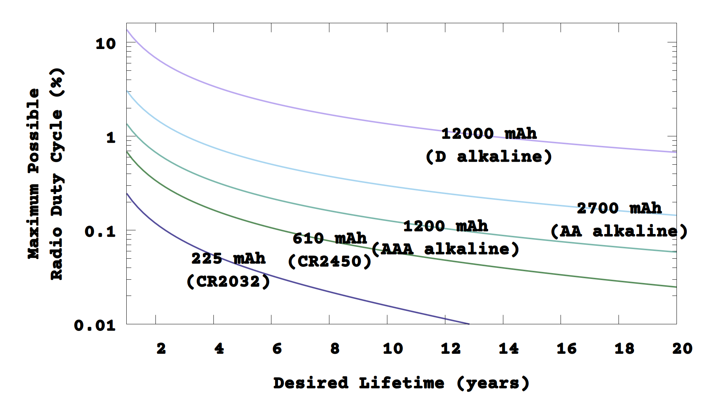
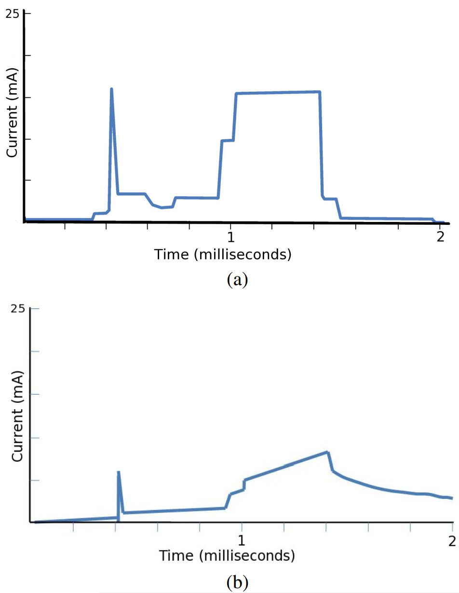
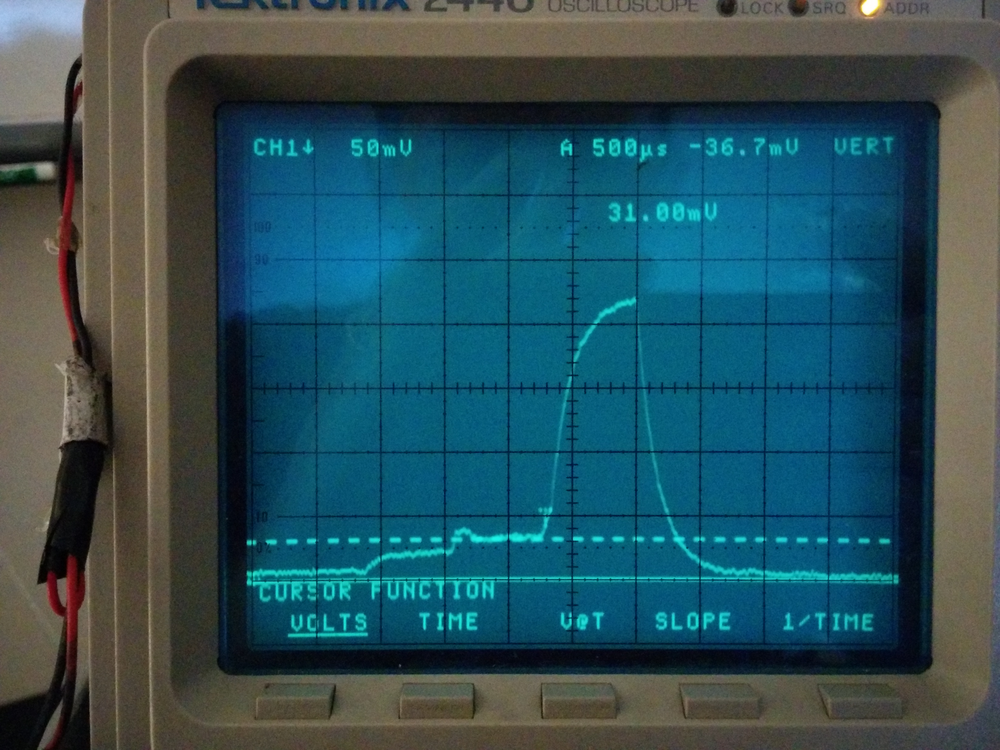
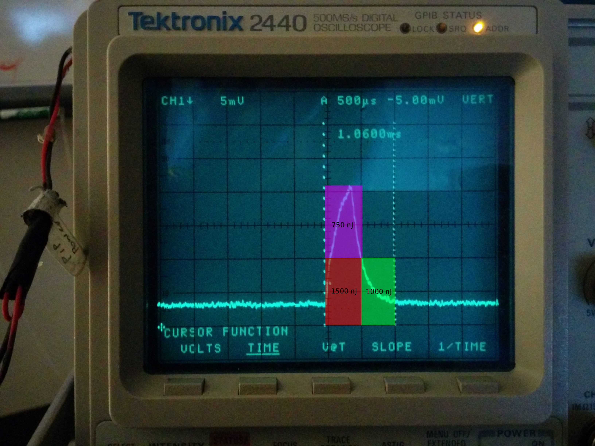
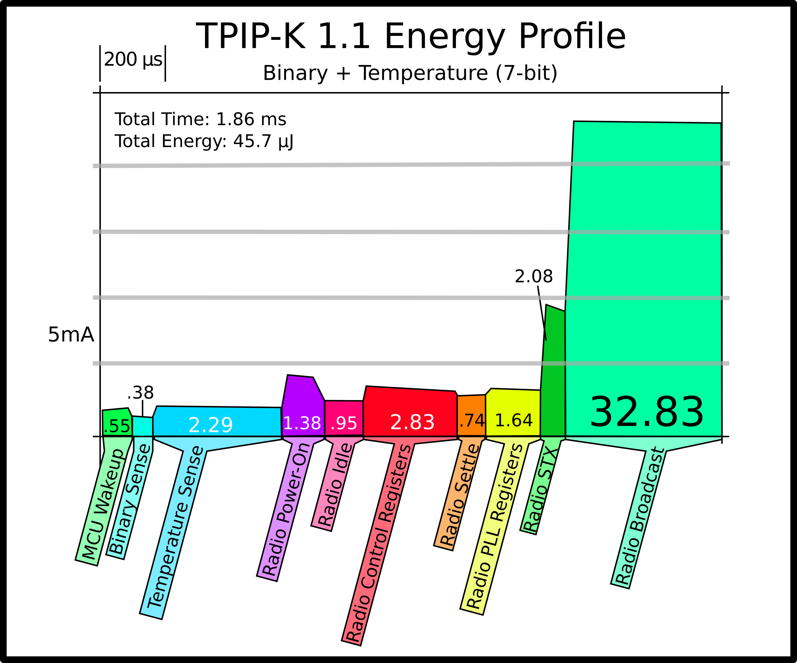
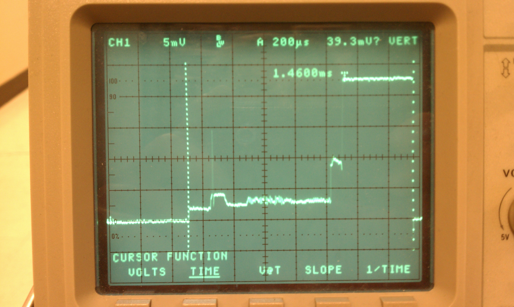
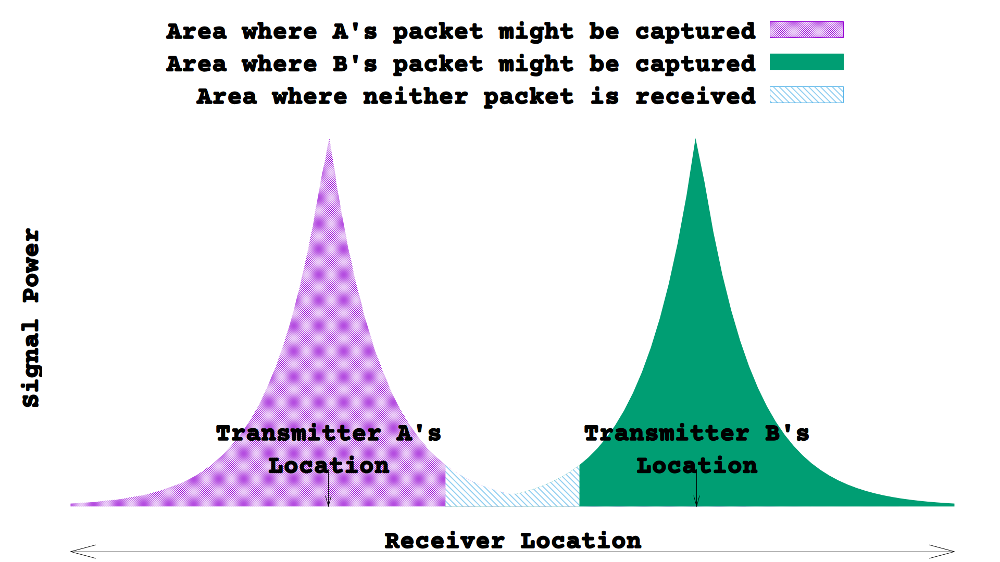
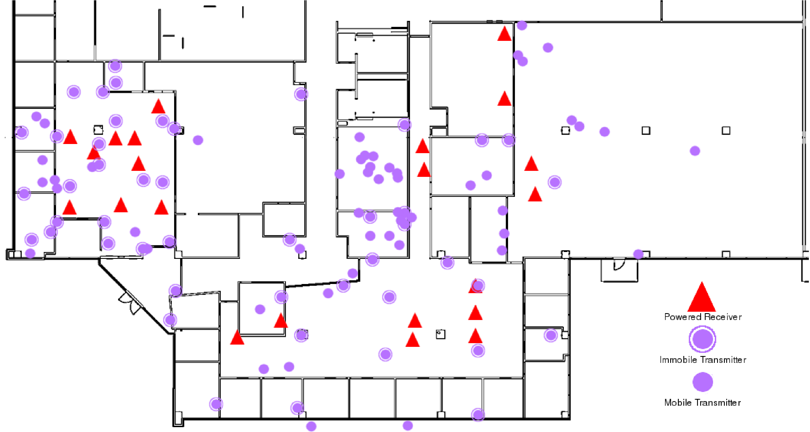
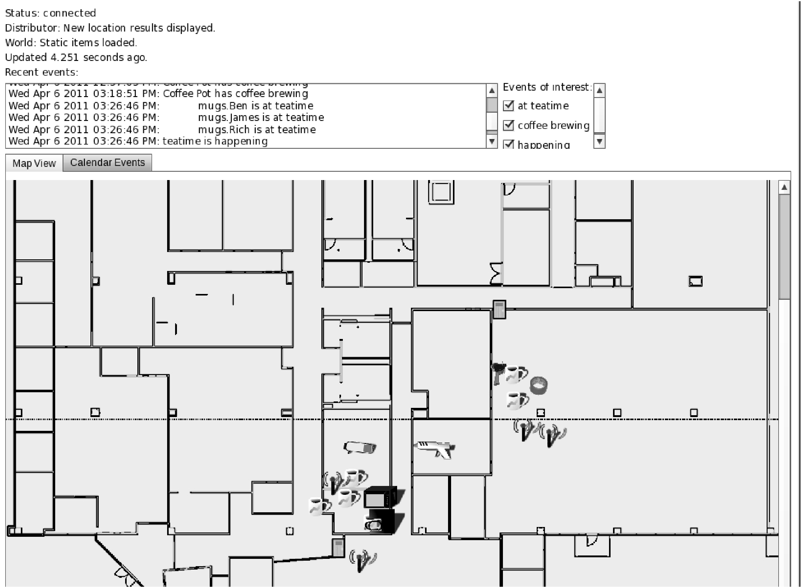
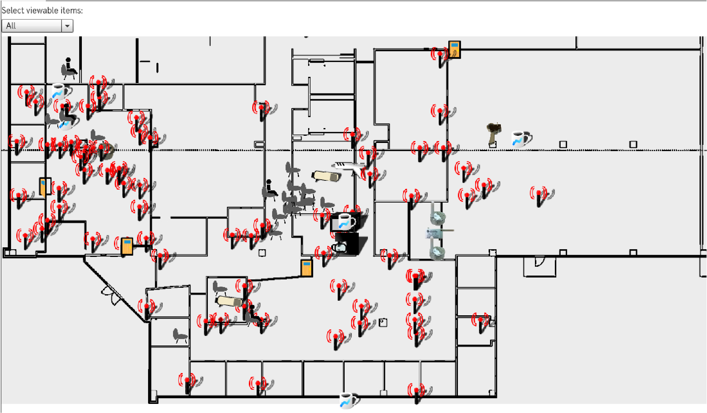

<!--
python3 -m mkslides build presentation.md && cp -r plugins/ site/
-->

<!-- Use this to grab and git add all images in a markdown file:
grep img lecture23.md | cut -d\" -f6 | xargs git add
-->

# PIP Tags

## Low Power Wireless Sensors

Bernhard Firner

2026-05-01

---

## The Moment

* The year is 2010
* The Internet is everywhere, but is not yet in every thing
  * The falling price of electronics promises to change that
* But if we put radios in every thing, will communication still work?

---

<!--
## The Goal

* We want bigger data and a smarter Internet of Things
  * Increased data should lead to smart decisions
  * This requires sensors and radios everywhere
* But this still hasn't happened
-->

## Problems

* We wanted bigger data and a smarter Internet of Things
* The world wasn't actually ready to use all of that data
* But, at the time, we had another fundamental issue
  * Wireless capacity isn't limitless
  * If everything has a sensor, how will we hear updates over the noise?

---

## Lifetimes

* We aren't discussing smart light bulbs
  * Wireless sensors aren't wired
  * They must run on a battery or scavenge power

* **The goal:** sensors with the same lifetimes as what they are sensing
  * For example, a sensor in a road that is scraped up with the old asphalt during resurfacing

---

## How Low is Low?

* A 200mAh coin cell can run a MCU for 8000 days in sleep mode
  * Or for 20 hours with a CC2500 radio on
* How can we squeeze out more information with lower radio use?

<!--
figure 1, with more visible lines
Lifetimes with different batteries
Show datasheet or image of the CC radio
Extend graph to 20 years.
-->

---

## The Secrets of Low Power

* Mine every bit and joule
* Talk less, don't listen
  * Receiving is more power hungry than transmitting
* Sense and transmit with high success rate
  * Retransmissions are a waste of energy

---

## Bits and Joules

* Minimizing energy consumption begins with measurements
* The first spike is from waking up the MCU
* The second, long plateau is data transmission

 
<small>The sudden current draw is too hard on the battery, so a capacitor is used to smooth it out.</small>

---

## Advances

* That example was from 2008
* Here is the result of a few years of hardware and software optimizations

 
<small>We cleaned up the circuit, shortened the preamble, and replaced CRC with parity.</small>

 
<small>Each type of sensing is done at a different time schedule, decoupling them from radio activity. This is temperature sensing.</small>

---

-v-

 
<small>A 12B packet with no sensing before the transmission.</small>

---

## Long Lifetimes

* A light, temperature, and humidity sensor could run for 8-9 years on a coin cell
  * Temperature and humidity sampled every 15 seconds
  * Light samples every 15s
  * Update every 15s
* Every 120s a long beacon is sent with logarithmically placed history
  * This fills in gaps during outages

-v-

## Side Story: Sensing

* All of the sensors were power optimized
* Light sensing, for example, involves charging an LED
  * The LED will discharge more rapidly if exposed to the light
* To sense, the MCU wakes up and charges the LED, then return to sleep
  * And interrupt wakes it when the LED discharges, and the time is recorded

---

## No Listening?

* What about listening?
  * Why? The only feedback we could get is of packet loss
  * So just retransmit the data next time around
* What about packet collisions?
  * Shorter packets are less likely to collide
  * Also, the *capture effect* makes collisions less problematic

---

## The Capture Effect

* FM radio stations broadcast on the same frequencies
  * But you only hear the one that you are closer to
* If the nearer transmitter is being received, it won't be interrupted by a weaker signal

 
<small>From a receiver's perspective, the more distant transmitter is noise.</small>

---

## Improving Captures

* If the distant transmitter begins first, it will be interrupted by the stronger signal
  * And they will both be lost, since the radio was busy
* Solution, part 1: Use two radios on the receiver
* Solution, part 2: Use multiple receivers, so neither packet is lost
  * Arrange the receivers so pairwise collisions at the same power level are minimized

-v-

## Capture Math

* We can calculate the probability that a capture will prevent collision loss between packets of duration $\delta$:
* First, $P_{\text{2-way collision}} = (1 - P_{capture})\frac{2\times \delta}{\tau}$
* $P(collision | \text{N transmitters}) = 1 - P(\text{no collision})^{N-1}$
  * $= 1 - (1 - (1 - P_{capture})\frac{2\times \delta}{\tau})^{N-1}$

-v-

* Capture occurs with a probability that scales with the relative signal power, $\Delta$
  * The signal power weakens with the attenuation factor, $\alpha$
* We can convert that into a relative distance

<math display="block" xmlns="http://www.w3.org/1998/Math/MathML"><semantics><mtable><mtr><mtd columnalign="right" style="text-align: right"><mfrac><mn>1</mn><msubsup><mi>l</mi><mn>1</mn><mi>α</mi></msubsup></mfrac></mtd><mtd columnalign="left" style="text-align: left"><mo>≥</mo><mfrac><msup><mn>10</mn><mrow><mi>Δ</mi><mi>/</mi><mn>10</mn></mrow></msup><msubsup><mi>l</mi><mn>2</mn><mi>α</mi></msubsup></mfrac></mtd></mtr><mtr><mtd columnalign="right" style="text-align: right"><msub><mi>l</mi><mn>1</mn></msub></mtd><mtd columnalign="left" style="text-align: left"><mo>≤</mo><msub><mi>l</mi><mn>2</mn></msub><msup><mn>10</mn><mrow><mo>−</mo><mi>Δ</mi><mi>/</mi><mn>10</mn><mi>α</mi></mrow></msup></mtd></mtr><mtr><mtd columnalign="right" style="text-align: right"><msub><mi>l</mi><mn>1</mn></msub></mtd><mtd columnalign="left" style="text-align: left"><mo>≤</mo><msub><mi>l</mi><mn>2</mn></msub><mi>C</mi><mo>,</mo><mtext mathvariant="normal">where C</mtext><mo>=</mo><msup><mn>10</mn><mrow><mo>−</mo><mi>Δ</mi><mi>/</mi><mn>10</mn><mi>α</mi></mrow></msup></mtd></mtr></mtable><annotation encoding="application/x-tex">\begin{align*}
\frac{1}{l_1^\alpha} &amp;\geq \frac{10^{\Delta/10}}{l_2^{\alpha}} \\
l_1 &amp;\leq l_2 10^{-\Delta/10\alpha} \\
l_1 &amp;\leq l_2 C, \text{where C} = 10^{-\Delta/10\alpha}
\end{align}</annotation></semantics></math>

-v-

## Probability

* If the transmitters are uniformly distributed, we can integrate over space to find the capture probability
  * $a$ and $b$ are the nearest and farthest distances, respectively, between a transmitter and receiver

<math display="block" xmlns="http://www.w3.org/1998/Math/MathML"><semantics><mtable><mtr><mtd columnalign="right" style="text-align: right"><msubsup><mo>∫</mo><mi>a</mi><mi>b</mi></msubsup><mspace width="-0.167em"></mspace><mfrac><mn>1</mn><mrow><mi>b</mi><mo>−</mo><mi>a</mi></mrow></mfrac><msubsup><mo>∫</mo><mi>a</mi><mrow><mi>c</mi><mi>x</mi></mrow></msubsup><mspace width="-0.167em"></mspace><mfrac><mn>1</mn><mrow><mi>b</mi><mo>−</mo><mi>a</mi></mrow></mfrac><mspace width="0.167em"></mspace><mi>d</mi><mi>y</mi><mspace width="0.167em"></mspace><mi>d</mi><mi>x</mi></mtd><mtd columnalign="left" style="text-align: left"><mo>=</mo></mtd><mtd columnalign="right" style="text-align: right"><mfrac><mn>1</mn><msup><mrow><mo stretchy="true" form="prefix">(</mo><mi>b</mi><mo>−</mo><mi>a</mi><mo stretchy="true" form="postfix">)</mo></mrow><mn>2</mn></msup></mfrac><msubsup><mo>∫</mo><mi>a</mi><mi>b</mi></msubsup><mrow><mo stretchy="true" form="prefix">(</mo><mi>c</mi><mi>x</mi><mo>−</mo><mi>a</mi><mo stretchy="true" form="postfix">)</mo></mrow><mspace width="0.167em"></mspace><mi>d</mi><mi>x</mi></mtd></mtr><mtr><mtd columnalign="right" style="text-align: right"></mtd><mtd columnalign="left" style="text-align: left"><mo>=</mo></mtd><mtd columnalign="right" style="text-align: right"><mfrac><mn>1</mn><msup><mrow><mo stretchy="true" form="prefix">(</mo><mi>b</mi><mo>−</mo><mi>a</mi><mo stretchy="true" form="postfix">)</mo></mrow><mn>2</mn></msup></mfrac><msubsup><mrow><mo stretchy="true" form="prefix">[</mo><mfrac><mrow><mi>c</mi><msup><mi>x</mi><mn>2</mn></msup></mrow><mn>2</mn></mfrac><mo>−</mo><mi>a</mi><mi>x</mi><mo stretchy="true" form="postfix">]</mo></mrow><mi>a</mi><mi>b</mi></msubsup></mtd></mtr><mtr><mtd columnalign="right" style="text-align: right"></mtd><mtd columnalign="left" style="text-align: left"><mo>=</mo></mtd><mtd columnalign="right" style="text-align: right"><mfrac><mi>c</mi><mn>2</mn></mfrac><mrow><mo stretchy="true" form="prefix">(</mo><msup><mi>b</mi><mn>2</mn></msup><mo>−</mo><msup><mi>a</mi><mn>2</mn></msup><mo stretchy="true" form="postfix">)</mo></mrow><mo>−</mo><mi>a</mi><mi>b</mi><mo>−</mo><msup><mi>a</mi><mn>2</mn></msup></mtd></mtr><mtr><mtd columnalign="right" style="text-align: right"></mtd><mtd columnalign="left" style="text-align: left"><mo>=</mo></mtd><mtd columnalign="right" style="text-align: right"><mfrac><mi>c</mi><mn>2</mn></mfrac><mrow><mspace width="0.333em"></mspace><mtext mathvariant="normal"> if </mtext><mspace width="0.333em"></mspace></mrow><mi>a</mi><mo>=</mo><mn>0</mn><mi>.</mi></mtd></mtr></mtable><annotation encoding="application/x-tex">\begin{align*}
\int_a^b \! \frac{1}{b-a} \int_a^{cx} \! \frac{1}{b-a} \, dy \, dx
&amp;=&amp; \frac{1}{(b-a)^2} \int_a^{b} (cx - a) \, dx  \\
&amp;=&amp; \frac{1}{(b-a)^2}\left[\frac{cx^2}{2} - ax\right]_a^b \\
&amp;=&amp; \frac{c}{2}\left(b^2 - a^2\right) - ab - a^2 \\
&amp;=&amp; \frac{c}{2} \text{ if } a = 0.
\end{align*}</annotation></semantics></math>

---

## High Transmission Success

* Evenly distributing receivers among the transmitters maximizes captures
* In the deployment below, the receiver with the best overall signal had reception rates from 80 to 89%
  * Two receivers boost that to a 95% packet reception rate
  * Three bring it above 99%

<!--
Images converted with
convert -density 300 /home/bfirner/projects/Winlab/gitpapers/TO_Architecture/Figures/deployment_map.eps -quality 100 deployment_map.png
-->

---

## Thoughts

* We successfully deployed the system in several environments
* As a demo in Winlab
* For long-term environmental monitoring in LAS
* Why didn't the Internet of Things take off?
  * Everyone wants special-purpose applications, but not everyone is a programmer
  * Perhaps now that AI can code for you, this idea will take off again

---

## Tea Time

-v-

## The Deployment

